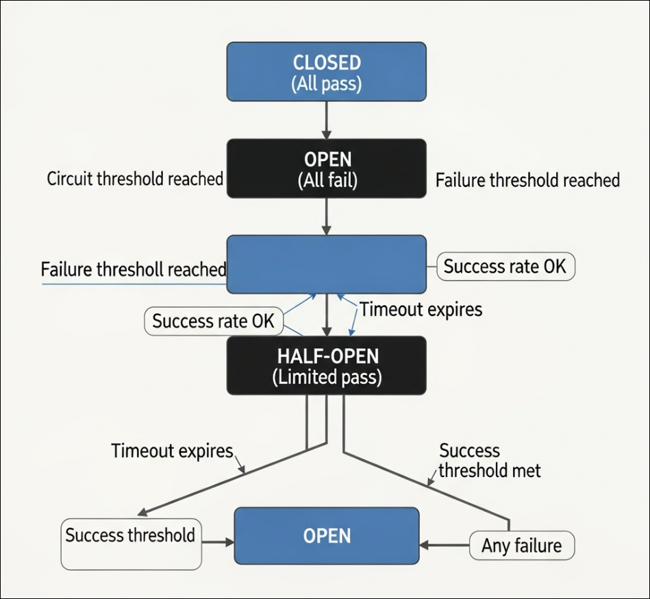

# **🔨 Go Circuit Breaker**

Một triển khai toàn diện, an toàn cho luồng và sẵn sàng cho sản xuất của **Mẫu Circuit Breaker** trong Go. Được thiết kế để xây dựng các microservice có khả năng phục hồi bằng cách ngăn chặn các lỗi xếp tầng và cung cấp khả năng xuống cấp nhẹ nhàng.

## **📋 Mục lục**

* [Tổng quan](#tổng-quan)
* [Kiến trúc](#kiến-trúc)
* [Cài đặt](#cài-đặt)
* [Bắt đầu nhanh](#bắt-đầu-nhanh)
* [Cấu hình](#cấu-hình)
* [Các khái niệm nâng cao](#các-khái-niệm-nâng-cao)
* [Số liệu & Giám sát](#số-liệu--giám-sát)
* [Bên trong & Hiệu suất](#bên-trong--hiệu-suất)
* [Các phương pháp hay nhất](#các-phương-pháp-hay-nhất)
* [Lộ trình & Trạng thái](#lộ-trình--trạng-thái)
* [Tham khảo](#tham-khảo)
* [Giấy phép](#giấy-phép)

## **🎯 Tổng quan**

Mẫu Circuit Breaker ngăn một ứng dụng liên tục cố gắng thực hiện một thao tác có khả năng thất bại, cho phép nó tiếp tục mà không cần chờ lỗi được khắc phục hoặc lãng phí chu kỳ CPU.

### **Các tính năng chính**

* ✅ **Ba trạng thái**: Quản lý trạng thái Closed, Open, Half-Open.
* ✅ **An toàn cho luồng**: Hoàn toàn an toàn để sử dụng đồng thời trong các hệ thống có thông lượng cao.
* ✅ **Cửa sổ trượt**: Tính toán tỷ lệ lỗi dựa trên thời gian để đảm bảo độ chính xác.
* ✅ **Không có chi phí**: Độ trễ cực thấp (<100ns) và các hoạt động không phân bổ trong đường dẫn nóng.
* ✅ **Khả năng quan sát**: Tích hợp sẵn số liệu Prometheus.
* ✅ **Chiến lược linh hoạt**: Ngắt mạch khi có lỗi liên tiếp, tỷ lệ lỗi hoặc các cuộc gọi chậm.
* ✅ **Nhận biết ngữ cảnh**: Hỗ trợ `context.Context` (hủy/hết thời gian).

## **🏗️ Kiến trúc**

### **Máy trạng thái**

Bộ ngắt mạch hoạt động như một máy trạng thái hữu hạn:
```
                ┌─────────────┐  
                │   CLOSED    │ ← Hoạt động bình thường
                │ (Tất cả đều qua)  │  
                └──────┬──────┘  
                       │  
            Ngưỡng     │    Tỷ lệ thành công OK
           lỗi         │  
            đạt        │  
                       │  
                ┌──────▼──────┐  
                │    OPEN     │ ← Chế độ thất bại nhanh
                │ (Tất cả đều thất bại)  │  
                └──────┬──────┘  
                       │  
            Hết        │  
            thời gian  │  
                       │  
                ┌──────▼──────────┐  
                │   HALF-OPEN     │ ← Thử nghiệm phục hồi
                │ (Giới hạn qua)  │  
                └──────┬──────────┘  
                       │  
            ┌──────────┴──────────┐  
            │                     │  
     Ngưỡng  │                │ Bất kỳ
    thành công│               │ lỗi nào
      đạt    │                │  
            │                     │  
        ┌───▼──┐              ┌──▼───┐  
        │CLOSED│              │ OPEN │  
        └──────┘              └──────┘
```

1.  **🟢 CLOSED**: Các yêu cầu đi qua. Số lần thành công/thất bại được theo dõi.
2.  **🔴 OPEN**: Yêu cầu thất bại ngay lập tức với `ErrCircuitOpen`. Không có cuộc gọi bên ngoài nào được thực hiện.
3.  **🟡 HALF-OPEN**: Sau một khoảng thời gian chờ, một số lượng giới hạn các yêu cầu "thăm dò" được cho phép để kiểm tra xem dịch vụ cơ bản đã phục hồi chưa.

## **📦 Cài đặt**

Để bắt đầu, hãy sao chép kho lưu trữ để chạy các ví dụ hoặc sử dụng `go get` để đưa nó vào dự án của bạn.
```bash
# Tùy chọn 1: Tích hợp vào dự án Go của bạn
go get github.com/NTbankey1/circuit-breaker

# Tùy chọn 2: Sao chép và chạy các ví dụ (ví dụ máy khách HTTP)
git clone https://github.com/NTbankey1/circuit-breaker
cd circuit-breaker

# Tải xuống các phụ thuộc
go mod download

# Chạy ví dụ HTTP (giả sử nó nằm trong cmd/http-example/main.go)
go run cmd/http-example/main.go
```

## **🚀 Bắt đầu nhanh**

### **Sử dụng cơ bản**

```go
package main

import (  
    "fmt"  
    "time"  
    "github.com/NTbankey1/circuit-breaker" // Nhập thư viện
)

func main() {  
    // 1\. Cấu hình bộ ngắt mạch
    config := circuitbreaker.Config{  
        MaxRequests: 3,               // Cho phép 3 yêu cầu trong Half-Open
        Timeout:     5 * time.Second, // Thời gian hồi chiêu trước khi thử phục hồi
        ReadyToTrip: func(counts circuitbreaker.Counts) bool {  
            // Ngắt nếu xảy ra 5 lỗi liên tiếp
            return counts.ConsecutiveFailures > 5  
        },  
    }  
      
    // 2\. Tạo phiên bản
    cb := circuitbreaker.New("my-service", config)  
      
    // 3\. Thực thi mã được bảo vệ bởi bộ ngắt mạch
    err := cb.Execute(func() error {  
        // Logic của bạn ở đây (ví dụ: cuộc gọi HTTP, truy vấn DB)
        return callExternalService()  
    })  
      
    if err == circuitbreaker.ErrCircuitOpen {  
        // Xử lý trạng thái mở (ví dụ: trả về dữ liệu được lưu trong bộ nhớ cache)
        fmt.Println("Mạch đang mở, bỏ qua yêu cầu")  
    } else if err != nil {  
        fmt.Printf("Yêu cầu thất bại: %v\n", err)  
    }  
} 
```

## **⚙️ Cấu hình**

Thư viện cung cấp khả năng kiểm soát chi tiết hành vi thông qua cấu trúc `Config`.
```go
config := circuitbreaker.Config{  
    // \--- Trạng thái Half-Open \---  
    // Số lượng yêu cầu được phép đi qua khi ở trạng thái Half-Open.
    MaxRequests: 3,  
      
    // \--- Trạng thái Closed \---  
    // Khoảng thời gian để đặt lại số đếm trong trạng thái Closed (nếu không sử dụng cửa sổ trượt).
    Interval: 10 * time.Second,  
      
    // \--- Trạng thái Open \---  
    // Thời gian chờ trước khi chuyển từ Open sang Half-Open.
    Timeout: 60 * time.Second,  
      
    // \--- Chiến lược lỗi \---  
    // Hàm để xác định khi nào cần ngắt mạch.
    ReadyToTrip: func(counts circuitbreaker.Counts) bool {  
        failureRatio := float64(counts.TotalFailures) / float64(counts.Requests)  
        // Ngắt nếu có từ 5 lỗi trở lên VÀ tỷ lệ lỗi >= 60%
        return counts.Requests >= 10 && failureRatio >= 0.6  
    },  
      
    // \--- Các lệnh gọi lại \---  
    OnStateChange: func(name string, from, to circuitbreaker.State) {  
        log.Printf("Mạch [%s] đã thay đổi trạng thái: %s → %s", name, from, to)  
    },  
}
```

### **Các cài đặt sẵn phổ biến**

*   **Bảo thủ**: Ngưỡng cao, thời gian chờ ngắn (Ưu tiên tính khả dụng).
*   **Tích cực**: Ngưỡng thấp, thời gian chờ dài (Ưu tiên bảo vệ hệ thống).

## **Các khái niệm nâng cao**

## **📊 Số liệu & Giám sát**

Thư viện này xuất các số liệu **Prometheus** tiêu chuẩn để giúp bạn trực quan hóa tình trạng hệ thống.
```
# Ví dụ đầu ra số liệu
circuit_breaker_requests_total{name="my-service"} 150  
circuit_breaker_failures_total{name="my-service"} 30  
circuit_breaker_state{name="my-service"} 0  # 0=Closed, 1=Half-Open, 2=Open
```

### **Thiết lập**
```go
// Đăng ký bộ thu thập số liệu (mã giả)
prometheus.MustRegister(circuitbreaker.NewCollector(cb))
```

## **🔬 Bên trong & Hiệu suất**

### **Máy trạng thái dựa trên thế hệ**

Để ngăn chặn các điều kiện tranh đua mà không cần khóa nặng, chúng tôi sử dụng bộ đếm Thế hệ.
Khi một yêu cầu bắt đầu, nó sẽ ghi lại Thế hệ hiện tại. Nếu trạng thái mạch thay đổi (ví dụ: Closed → Open) trong khi yêu cầu đang được xử lý, kết quả của yêu cầu đó sẽ bị loại bỏ đối với logic chuyển đổi trạng thái vì thế hệ của nó hiện đã lỗi thời.

### **Thuật toán cửa sổ trượt**

Chúng tôi triển khai một cửa sổ trượt để tính toán tỷ lệ lỗi một cách chính xác theo thời gian, thay vì chỉ là số đếm tuyệt đối.
```
Thời gian: ─────────────────────────────────────────────────►  
      │   B1   │   B2   │   B3   │   B4   │   B5   │  
      │ 2F 3S │ 1F 4S │ 0F 5S │ 3F 2S │ 1F 4S │
```

### **Điểm chuẩn**

Việc triển khai được tối ưu hóa cho đường dẫn nóng.
```
BenchmarkCircuitBreaker_Closed    12,330,307    95.43 ns/op    0 B/op    0 allocs/op  
BenchmarkCircuitBreaker_Open      25,189,135    47.23 ns/op    0 B/op    0 allocs/op
```

## **✅ Các phương pháp hay nhất**

1.  **Luôn xác định các phương án dự phòng**: Không bao giờ để `ErrCircuitOpen` nổi lên cho người dùng mà không xử lý nó (ví dụ: trả về dữ liệu mặc định, phản hồi được lưu trong bộ nhớ cache hoặc một lỗi thân thiện).
2.  **Cách ly các mạch**: Không chia sẻ một phiên bản bộ ngắt mạch duy nhất trên các dịch vụ hạ nguồn khác nhau. Tạo một cho AuthService, một cho PaymentService, v.v.
3.  **Điều chỉnh thời gian chờ**: `Timeout` (Open → Half-Open) phải đủ dài để dịch vụ hạ nguồn thực sự phục hồi.
4.  **Giám sát**: Thiết lập cảnh báo cho các thay đổi `circuit_breaker_state`. Một mạch dao động (liên tục chuyển đổi trạng thái) cho thấy một phụ thuộc không ổn định.

## **🚧 Lộ trình & Trạng thái**

- [x] **Cốt lõi**: Các trạng thái Closed/Open/Half-Open
- [x] **Đồng thời**: Triển khai Mutex an toàn cho luồng
- [x] **Ngữ cảnh**: Hỗ trợ `ExecuteWithContext`
- [x] **Cửa sổ trượt**: Tính toán tỷ lệ chính xác
- [x] **Phần mềm trung gian**: Trình bao bọc Máy khách/Máy chủ HTTP
- [ ] **Phân tán**: Chia sẻ trạng thái dựa trên Redis
- [ ] **Thích ứng**: Tự động điều chỉnh ngưỡng

## **📖 Tham khảo**

*   [Martin Fowler - Circuit Breaker](https://martinfowler.com/bliki/CircuitBreaker.html)
*   [Microsoft - Các mẫu thiết kế đám mây](https://learn.microsoft.com/en-us/azure/architecture/patterns/circuit-breaker)

## **📄 Giấy phép**

Dự án này được cấp phép theo Giấy phép MIT - xem tệp [LICENSE](LICENSE) để biết chi tiết.