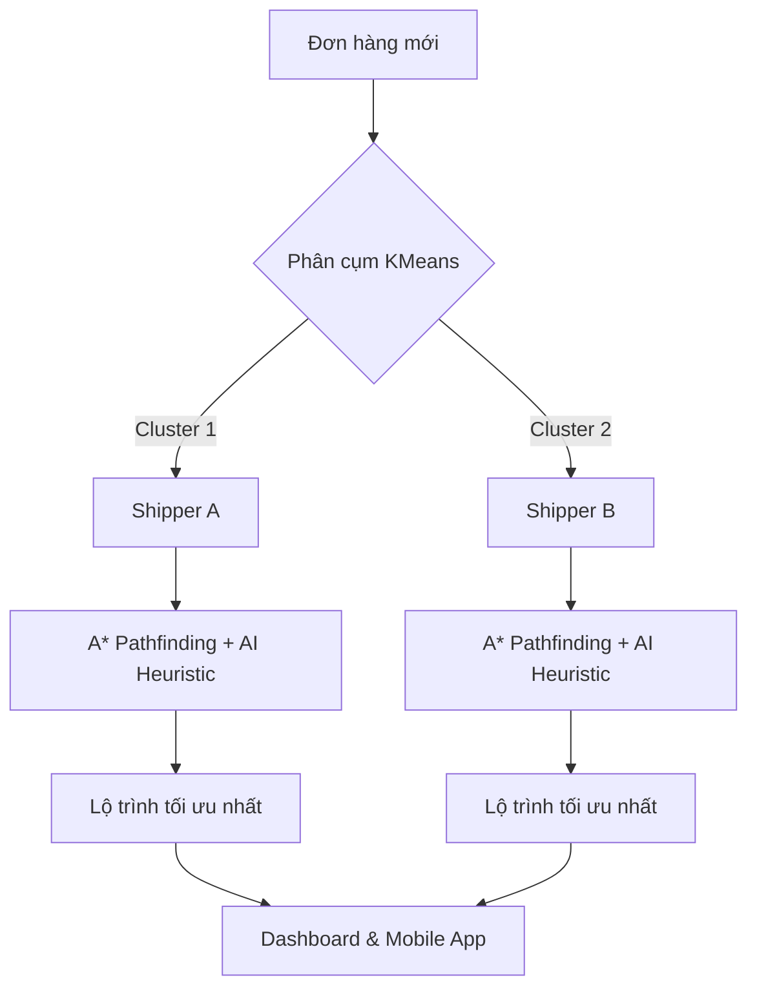

# LogiSense AI: Nền Tảng Tối Ưu Logistics Dựa Trên AI & Heuristic

<div align="center">
  
  <br />
  <p align="center">
    <b>Giải pháp quản lý vận tải thông minh tích hợp AdaBoost Regressor & Thuật toán A*</b>
    <br />
    <br />
    
    
    
    
    
  </p>
</div>

---

## 🌟 Điểm Nhấn Công Nghệ

**LogiSense AI** không chỉ là một ứng dụng quản lý đơn thuần, mà là một sản phẩm kỹ thuật cao cấp kết hợp giữa **Machine Learning** và **Operations Research**:

- **Dự đoán ETA thông minh:** Sử dụng thuật toán **AdaBoost** (Ensemble Learning) để học từ hàng triệu điểm dữ liệu giao thông, giúp dự đoán thời gian giao hàng với sai số (MAE) cực thấp.
- **Tối ưu lộ trình đa tầng:** Kết hợp **K-Means Clustering** để phân vùng khu vực và **A* Search** (với heuristic từ AI) để sắp xếp thứ tự giao hàng tối ưu nhất.
- **Kiến trúc Hiệu năng cao:** Hệ thống được tối ưu hóa cho các bài toán thời gian thực với độ trễ cực thấp.

## ⚙️ Quy Trình Vận Hành (System Workflow)


```mermaid
graph TD
    A[Đơn hàng mới] --> B{Phân cụm KMeans}
    B -->|Cluster 1| C[Shipper A]
    B -->|Cluster 2| D[Shipper B]
    C --> E[A* Pathfinding + AI Heuristic]
    D --> F[A* Pathfinding + AI Heuristic]
    E --> G[Lộ trình tối ưu nhất]
    F --> H[Lộ trình tối ưu nhất]
    G --> I[Dashboard & Mobile App]
    H --> I
```

## 🚀 Kỹ Thuật Tối Ưu Hóa (High-Performance Engineering)

Dự án được triển khai với các tiêu chuẩn kỹ thuật của một hệ thống **Senior-level**:

1. **Singleton AI Service:** Model AdaBoost được nạp một lần duy nhất vào bộ nhớ (In-memory) để đảm bảo tốc độ inference < 10ms.
2. **Threaded Connection Pooling:** Sử dụng `ThreadedConnectionPool` cho PostgreSQL để xử lý đồng thời hàng trăm yêu cầu mà không gây nghẽn cổ chai dữ liệu.
3. **Advanced Async/Sync Handling:** Kết hợp thông minh giữa `async def` cho các I/O tasks và `def` (Thread Pool) cho các tác vụ CPU-bound (A*), giúp Event Loop luôn giải phóng.
4. **Resilient Architecture:** Tích hợp Redis Cache để lưu trữ các kết quả dự đoán ETA cho các tọa độ lân cận, giảm tải cho CPU.

## 🛠️ Khởi Chạy Nhanh

```bash
# Clone và Setup
git clone https://github.com/ntbankey/logisense-ai.git
cp .env.example .env

# Chạy bằng Docker (Khuyên dùng)
docker compose up --build -d
```

- **Giao diện:** [http://localhost:3000](http://localhost:3000)
- **Tài liệu API:** [http://localhost:8000/docs](http://localhost:8000/docs)

## 📖 Tài Liệu Chuyên Sâu

- 📑 [**Tổng quan hệ thống**](docs/overview.md) - Tầm nhìn và mục tiêu.
- 📂 [**Cấu trúc dự án**](docs/project_structure.md) - Chi tiết các lớp (Layers).
- 🧠 [**Kiến trúc ML & Heuristic**](docs/architecture.md) - Giải thích AdaBoost + A*.
- 🚀 [**Hướng dẫn triển khai**](docs/setup.md) - Setup chi tiết và Debug.

---
<div align="center">
  <p>Thiết kế bởi <b>Senior System Design Team</b></p>
  <p>© 2026 LogiSense AI. Tất cả quyền được bảo lưu.</p>
</div>
