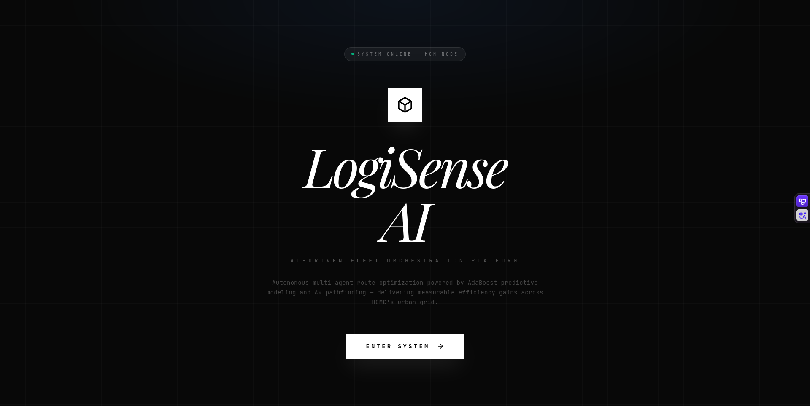
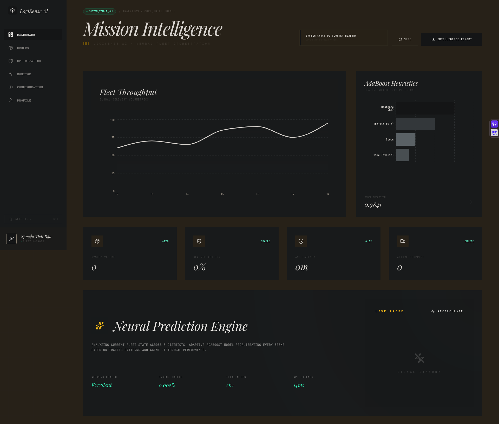
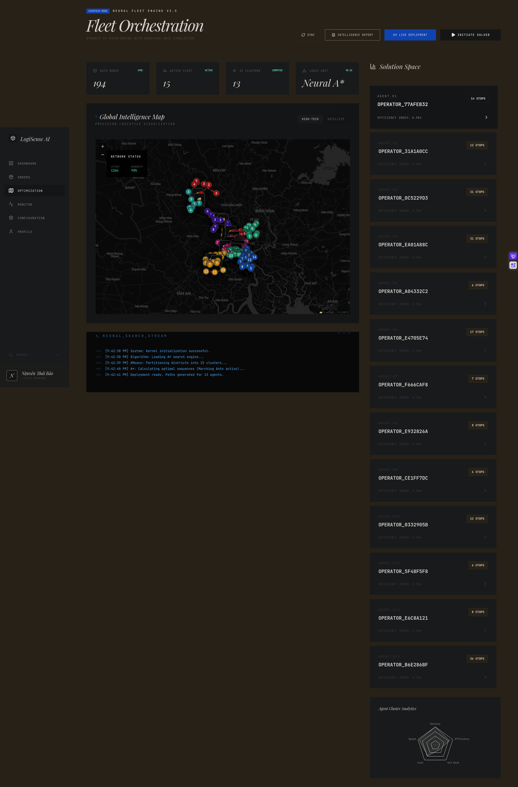
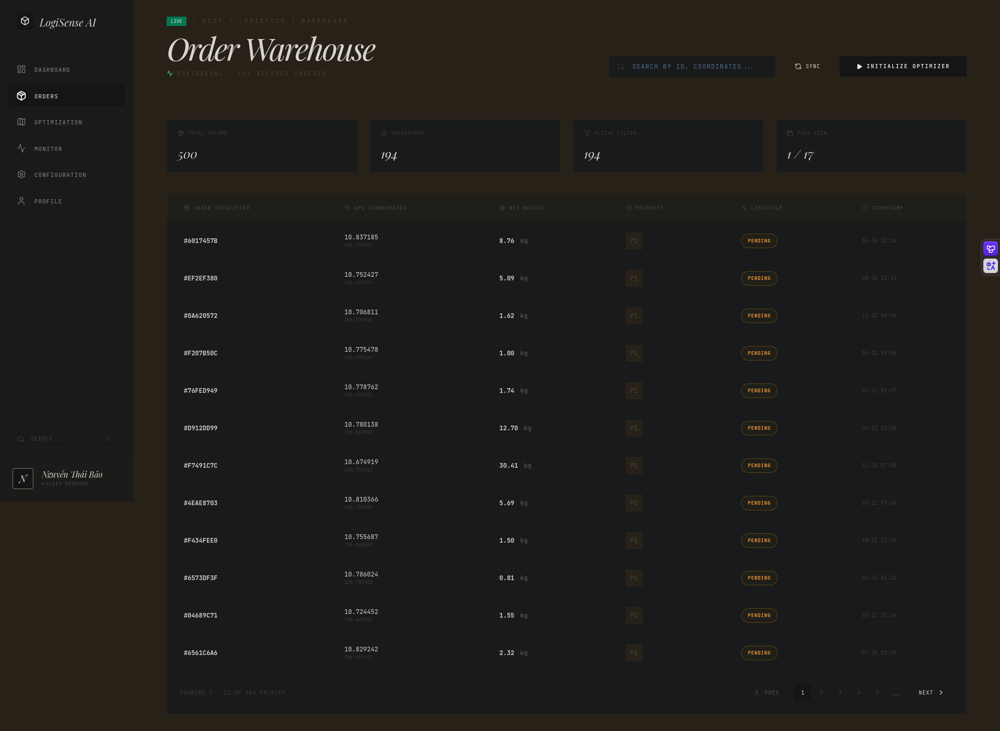
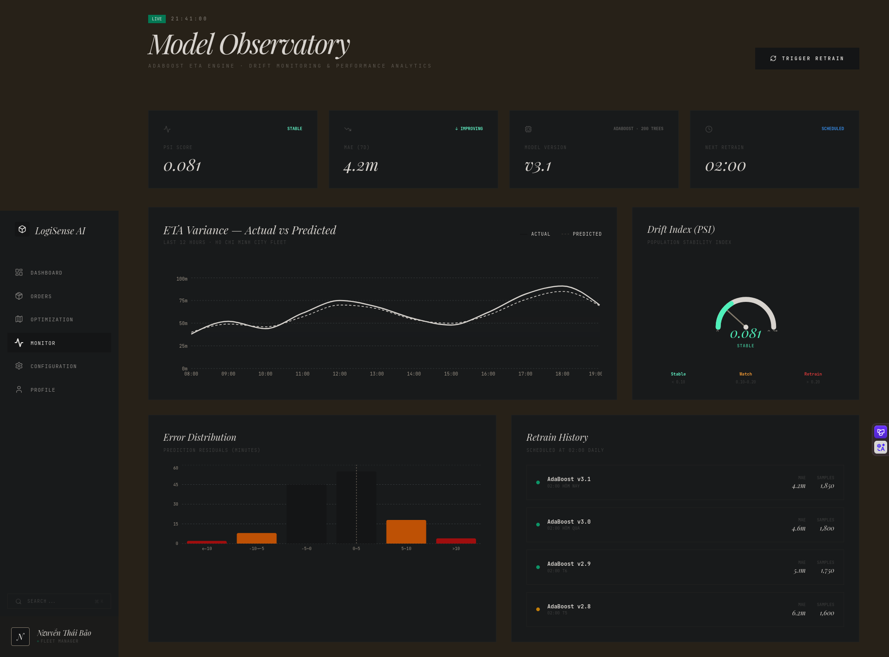
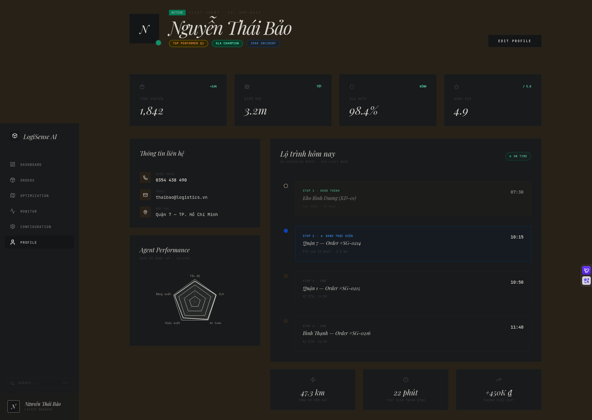
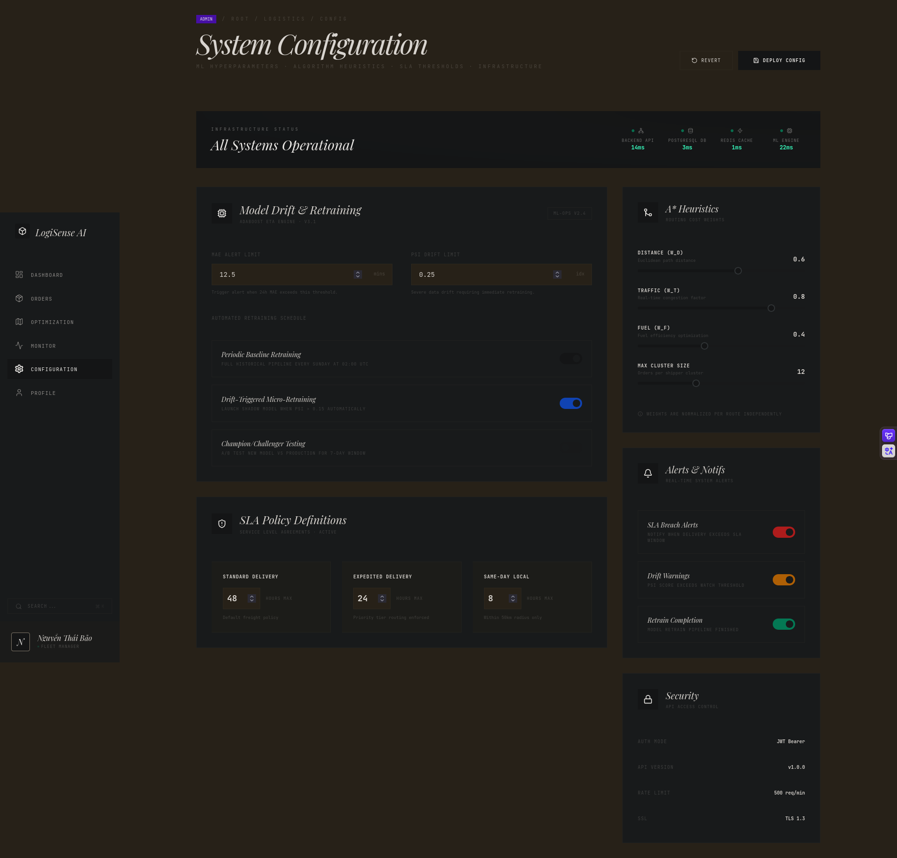
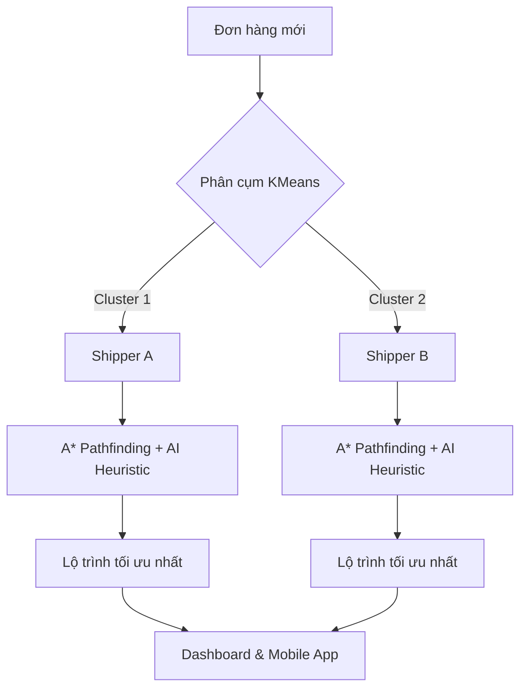

# LogiSense AI: Nền Tảng Tối Ưu Logistics Dựa Trên AI & Heuristic

<div align="center">
  
  <br />
  <p align="center">
    <b>Giải pháp quản lý vận tải thông minh tích hợp AdaBoost Regressor & Thuật toán A*</b>
    <br />
    <br />
    
    
    
    
    
  </p>
</div>

---

## 🚀 Tổng Quan Dự Án

**LogiSense AI** là giải pháp phần mềm thông minh giải quyết các thách thức phức tạp trong logistics hiện đại bằng cách kết hợp **Machine Learning** và **Operations Research**. Hệ thống tập trung vào tối ưu hóa thời gian giao hàng (ETA) và lộ trình di chuyển của shipper.

## 📸 Giao Diện Ứng Dụng (UI Showcase)

### 📊 Dashboard Vận Hành
Tổng quan về các chỉ số KPI, số lượng đơn hàng và trạng thái shipper trong thời gian thực.


### 📍 Tối Ưu Hóa Lộ Trình
Giao diện chính để phân cụm đơn hàng và tìm kiếm đường đi tối ưu bằng thuật toán A* kết hợp AI Heuristic.


### 📦 Quản Lý Đơn Hàng
Theo dõi danh sách đơn hàng, trạng thái và ưu tiên xử lý.


### 🖥️ Giám Sát Thời Gian Thực
Theo dõi vị trí và tiến độ giao hàng của từng shipper trên bản đồ.


### 👤 Cá Nhân Hóa & Cấu Hình
Quản lý hồ sơ người dùng và các thiết lập hệ thống.
<div align="center">
  
  
</div>

---

## ⚙️ Quy Trình Vận Hành (System Workflow)


```mermaid
graph TD
    A[Đơn hàng mới] --> B{Phân cụm KMeans}
    B -->|Cluster 1| C[Shipper A]
    B -->|Cluster 2| D[Shipper B]
    C --> E[A* Pathfinding + AI Heuristic]
    D --> F[A* Pathfinding + AI Heuristic]
    E --> G[Lộ trình tối ưu nhất]
    F --> H[Lộ trình tối ưu nhất]
    G --> I[Dashboard & Mobile App]
    H --> I
```

## 🚀 Kỹ Thuật Tối Ưu Hóa (High-Performance Engineering)

Dự án được triển khai với các tiêu chuẩn kỹ thuật của một hệ thống **Senior-level**:

1. **Singleton AI Service:** Model AdaBoost được nạp một lần duy nhất vào bộ nhớ (In-memory) để đảm bảo tốc độ inference < 10ms.
2. **Threaded Connection Pooling:** Sử dụng `ThreadedConnectionPool` cho PostgreSQL để xử lý đồng thời hàng trăm yêu cầu mà không gây nghẽn cổ chai dữ liệu.
3. **Advanced Async/Sync Handling:** Kết hợp thông minh giữa `async def` cho các I/O tasks và `def` (Thread Pool) cho các tác vụ CPU-bound (A*), giúp Event Loop luôn giải phóng.

## 🛠️ Khởi Chạy Nhanh

```bash
# Clone và Setup
git clone https://github.com/ntbankey/logisense-ai.git
cp .env.example .env

# Chạy bằng Docker (Khuyên dùng)
docker compose up --build -d
```

## 📖 Tài Liệu Chuyên Sâu

- 📑 [**Tổng quan hệ thống**](docs/overview.md)
- 📂 [**Cấu trúc dự án**](docs/project_structure.md)
- 🧠 [**Kiến trúc ML & Heuristic**](docs/architecture.md)
- 🚀 [**Hướng dẫn triển khai**](docs/setup.md)

---
<div align="center">
  <p>Thiết kế bởi <b>Senior System Design Team</b></p>
  <p>© 2026 LogiSense AI. Tất cả quyền được bảo lưu.</p>
</div>
