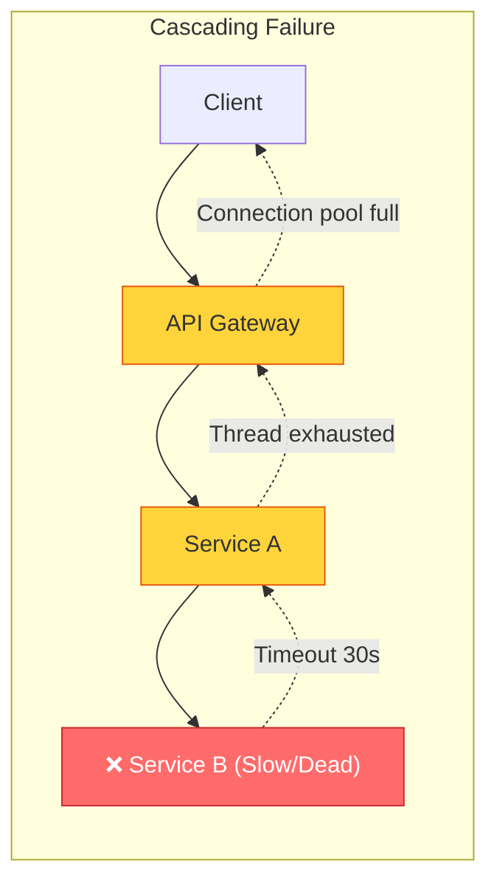
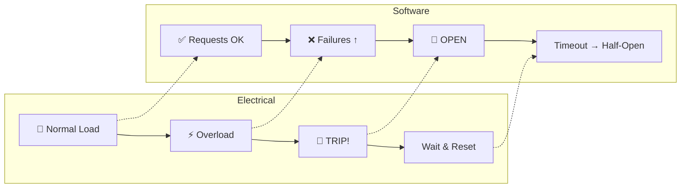
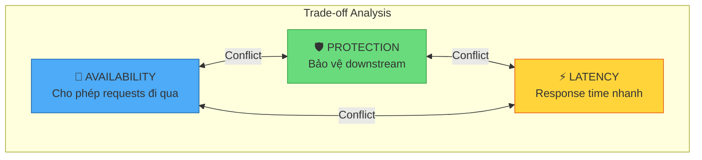
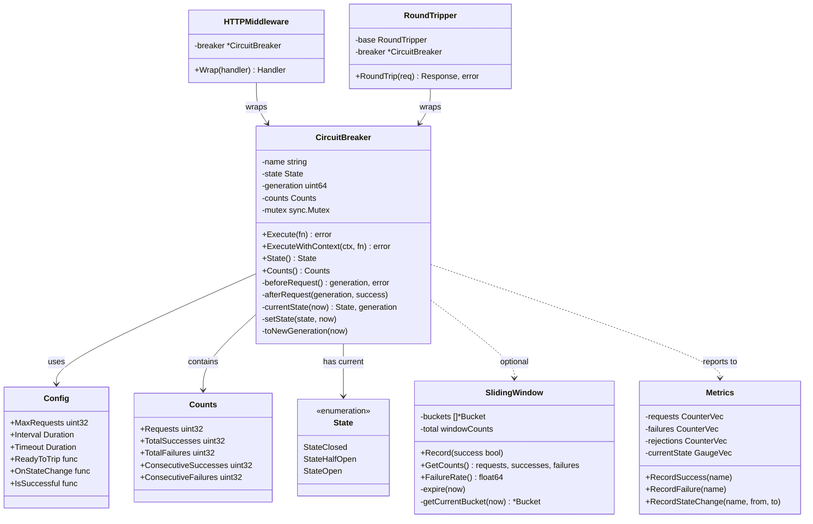
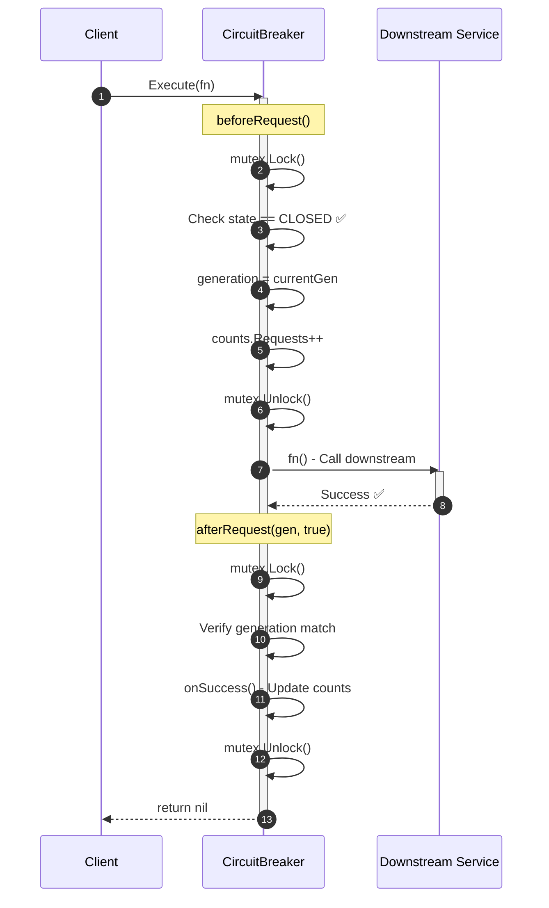
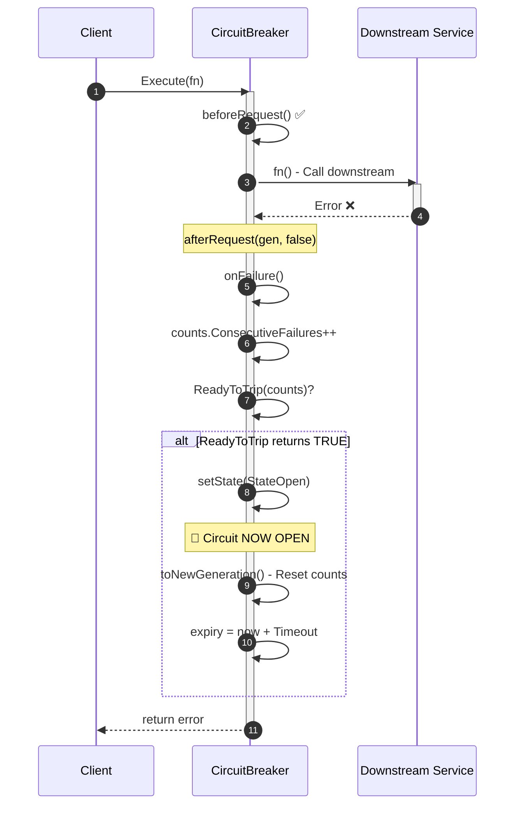
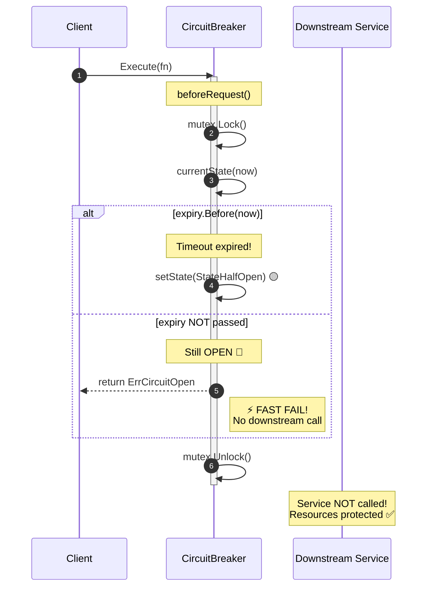
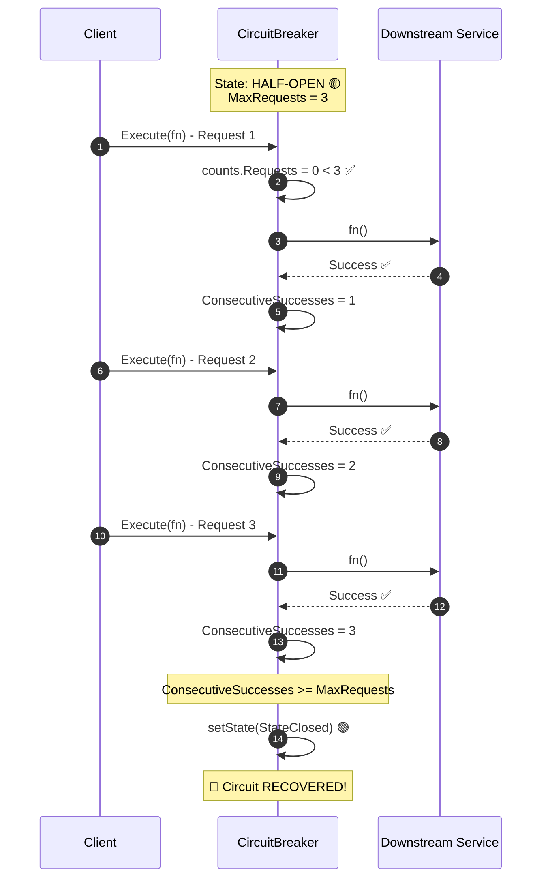
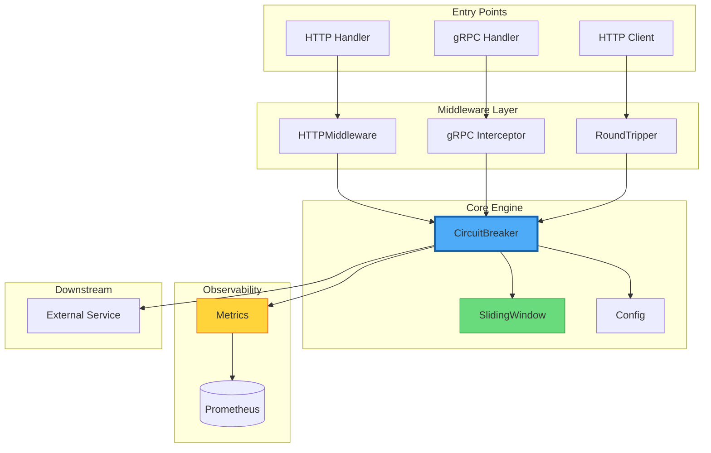
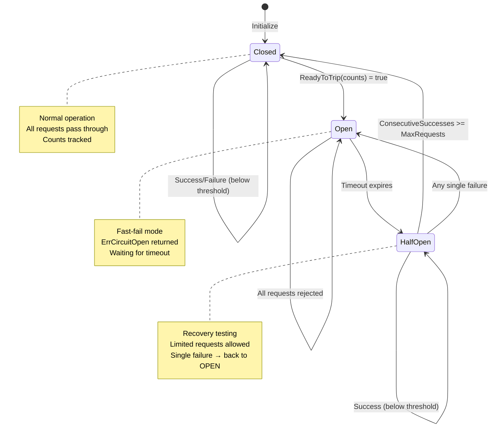

# 🗺️ GRAND MAP: Circuit Breaker Pattern Deep Dive

> **Tài liệu tổng quan kiến trúc** - Điểm khởi đầu để hiểu toàn bộ hệ thống Circuit Breaker

---

## 📚 Mục Lục

1. [First Principles: Tại sao cần Circuit Breaker?](#1-first-principles-tại-sao-cần-circuit-breaker)
2. [Architecture Overview](#2-architecture-overview)
3. [Request Lifecycle Flow](#3-request-lifecycle-flow)
4. [Component Interaction Map](#4-component-interaction-map)
5. [Cross-Reference Matrix](#5-cross-reference-matrix)

---

## 1. First Principles: Tại sao cần Circuit Breaker?

### 1.1 Vấn Đề: Cascading Failures

Trong Distributed Systems, một service chậm hoặc fail có thể gây ra **hiệu ứng domino**:



**Vấn đề cốt lõi**:

- 🔴 **Thread starvation**: Requests chờ service chết → thread pool cạn kiệt
- 🔴 **Resource exhaustion**: Connections, memory, CPU bị hold vô ích
- 🔴 **Cascading timeout**: 1 service chậm → tất cả upstream services chậm theo

### 1.2 Electrical Analogy → Software Pattern

| Electrical Circuit Breaker | Software Circuit Breaker |
|---------------------------|-------------------------|
| Quá tải điện → cắt mạch | Quá nhiều failures → reject requests |
| Tự động đóng lại sau thời gian | Timeout → chuyển sang Half-Open |
| Bảo vệ thiết bị điện | Bảo vệ resources (threads, connections) |



### 1.3 Trade-off Triangle



**Circuit Breaker giải quyết bằng cách**:

- ✅ **Fast-fail**: Reject ngay khi circuit OPEN → giảm latency
- ✅ **Graceful degradation**: Fallback thay vì error → giữ availability
- ✅ **Recovery testing**: Half-Open state → tự phục hồi khi service khỏe

---

## 2. Architecture Overview

### 2.1 Package Structure

```
circuit-breaker/
├── internal/
│   ├── circuitbreaker/
│   │   ├── breaker.go         # Core state machine
│   │   ├── state.go           # State & Counts definitions
│   │   ├── config.go          # Configuration options
│   │   ├── sliding_window.go  # Failure rate algorithm
│   │   ├── context.go         # Context-aware execution
│   │   ├── fallback.go        # Fallback strategies
│   │   └── metrics.go         # Prometheus integration
│   └── middleware/
│       ├── http_middleware.go # HTTP server/client wrappers
│       └── grpc_interceptor.go# gRPC interceptors
├── pkg/
│   └── client/
│       └── http.go            # HTTP client wrapper
└── cmd/
    └── http-example/
        └── main.go            # Demo application
```

### 2.2 Class Diagram: Component Relationships



---

## 3. Request Lifecycle Flow

### 3.1 Happy Path: Circuit Closed



### 3.2 Circuit Opens: Failure Threshold Reached



### 3.3 Fast-Fail: Circuit Open



### 3.4 Recovery: Half-Open Testing



---

## 4. Component Interaction Map

### 4.1 Data Flow Diagram



### 4.2 State Transition Diagram



---

## 5. Cross-Reference Matrix

### 📖 Tài liệu Deep-Dive

| Document | Chủ đề | Keywords |
|----------|--------|----------|
| [01-STATE-MACHINE-INTERNALS.md](./01-STATE-MACHINE-INTERNALS.md) | FSM, Generation Counter, State Transitions | `beforeRequest`, `afterRequest`, `generation`, `TOCTOU` |
| [02-SLIDING-WINDOW-ALGORITHM.md](./02-SLIDING-WINDOW-ALGORITHM.md) | Time-based failure rate, Bucket algorithm | `SlidingWindow`, `Bucket`, `expire`, `FailureRate` |
| [03-CONCURRENCY-PATTERNS.md](./03-CONCURRENCY-PATTERNS.md) | Thread Safety, Mutex, Lock contention | `sync.Mutex`, `RWMutex`, `defer`, `panic recovery` |
| [04-MIDDLEWARE-INTEGRATION.md](./04-MIDDLEWARE-INTEGRATION.md) | HTTP/gRPC wrappers, Error classification | `HTTPMiddleware`, `RoundTripper`, `Interceptor`, `IsSuccessful` |
| [05-OBSERVABILITY.md](./05-OBSERVABILITY.md) | Prometheus, Alerting, Dashboards | `Metrics`, `CounterVec`, `GaugeVec`, `HistogramVec` |

### 🔗 Source Code Quick Links

| Component | File | Key Functions |
|-----------|------|---------------|
| Core Breaker | [breaker.go](../internal/circuitbreaker/breaker.go) | `New()`, `Execute()`, `beforeRequest()`, `afterRequest()` |
| State Types | [state.go](../internal/circuitbreaker/state.go) | `State`, `Counts`, `StateClosed`, `StateOpen` |
| Configuration | [config.go](../internal/circuitbreaker/config.go) | `Config`, `ReadyToTrip`, `OnStateChange` |
| Sliding Window | [sliding_window.go](../internal/circuitbreaker/sliding_window.go) | `SlidingWindow`, `Record()`, `FailureRate()` |
| Context Support | [context.go](../internal/circuitbreaker/context.go) | `ExecuteWithContext()`, `SlowCallDetector` |
| Fallback | [fallback.go](../internal/circuitbreaker/fallback.go) | `ExecuteWithFallback()`, `CacheFallback()` |
| Metrics | [metrics.go](../internal/circuitbreaker/metrics.go) | `Metrics`, `RecordSuccess()`, `RecordStateChange()` |
| HTTP Middleware | [http_middleware.go](../internal/middleware/http_middleware.go) | `HTTPMiddleware`, `RoundTripper` |
| gRPC Interceptor | [grpc_interceptor.go](../internal/middleware/grpc_interceptor.go) | `UnaryClientInterceptor()`, `StreamClientInterceptor()` |

---

## 🎯 Key Takeaways

> [!IMPORTANT]
> **Circuit Breaker Pattern = Fail Fast + Graceful Degradation + Self-Healing**

1. **Fail Fast**: Khi circuit OPEN, reject ngay → không lãng phí resources
2. **Graceful Degradation**: Sử dụng fallback thay vì hard error
3. **Self-Healing**: Half-Open state tự động test recovery

> [!TIP]
> **Best Practice**: Mỗi downstream service nên có circuit breaker riêng biệt. KHÔNG share một circuit breaker cho nhiều services khác nhau!

---

**Next**: [01-STATE-MACHINE-INTERNALS.md](./01-STATE-MACHINE-INTERNALS.md) - Đi sâu vào State Machine và Generation-based concurrency →
