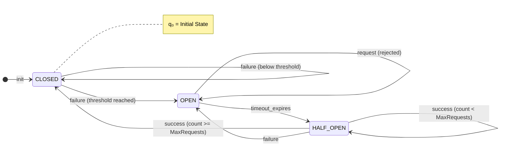
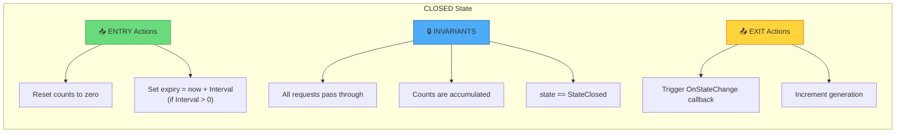
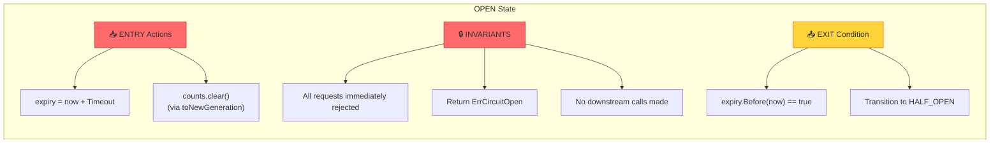
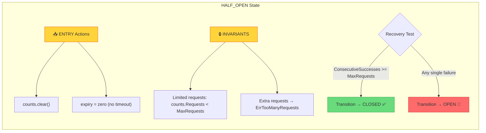
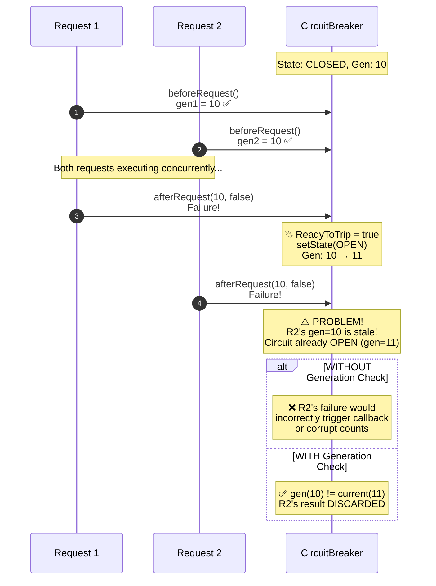
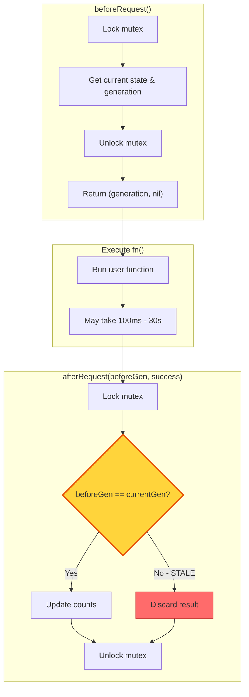
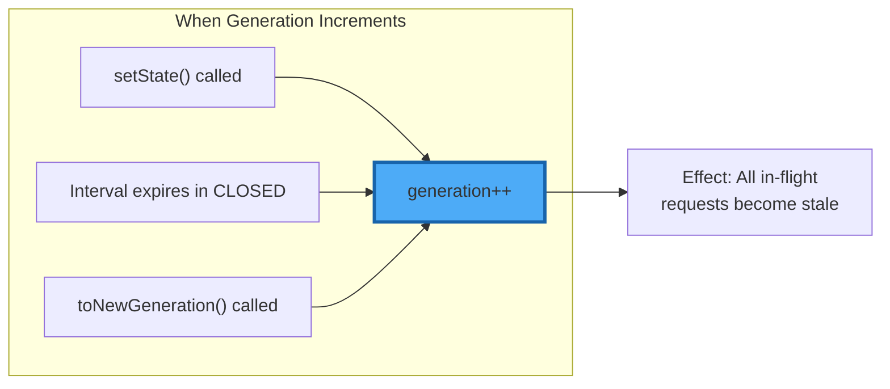
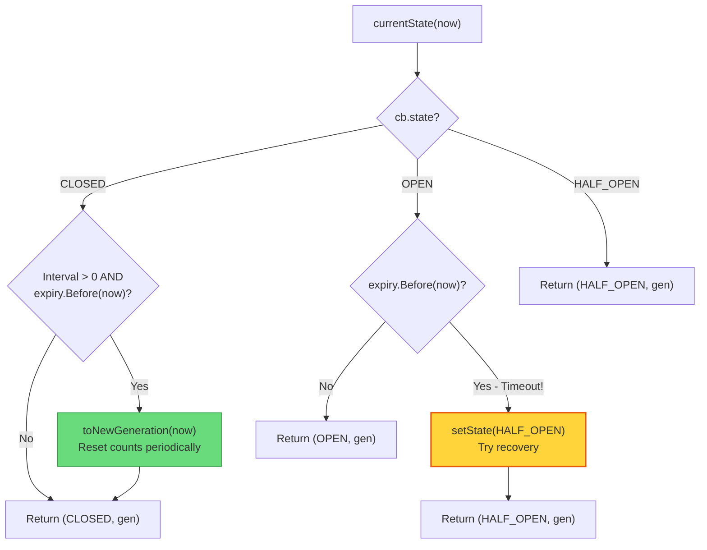
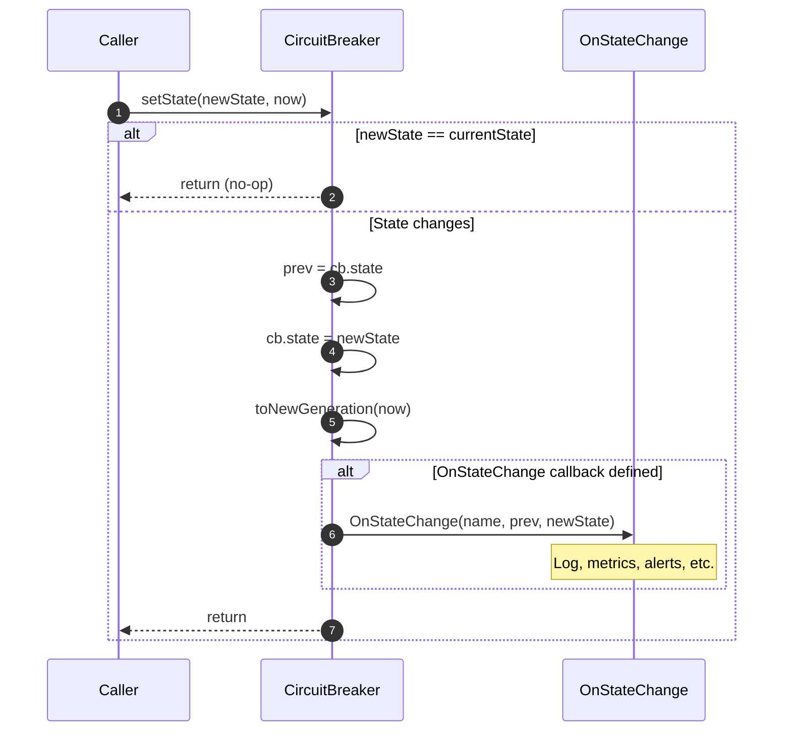
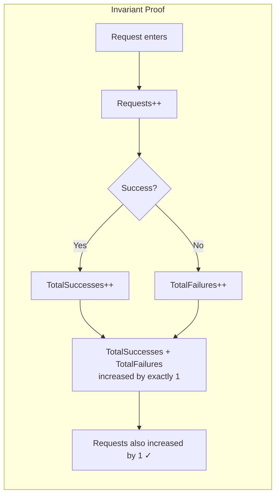

# ⚙️ STATE MACHINE INTERNALS: Generation-Based Concurrency

> **Deep Dive**: Finite State Machine implementation với Generation Counter để prevent race conditions

---

## 📚 Mục Lục

1. [First Principles: Finite State Machines](#1-first-principles-finite-state-machines)
2. [The Three States - Deep Analysis](#2-the-three-states---deep-analysis)
3. [Generation Counter - Race Condition Prevention](#3-generation-counter---race-condition-prevention)
4. [State Transition Logic](#4-state-transition-logic)
5. [Mathematical Proof](#5-mathematical-proof)

---

## 1. First Principles: Finite State Machines

### 1.1 FSM Formal Definition

Một **Finite State Machine** (FSM) được định nghĩa bởi tuple:

```
FSM = (Q, Σ, δ, q₀, F)

Trong đó:
- Q  = Tập hợp hữu hạn các states (Closed, Open, Half-Open)
- Σ  = Alphabet - tập hợp các events/inputs (Success, Failure, Timeout)
- δ  = Transition function: Q × Σ → Q
- q₀ = Initial state (Closed)
- F  = Accepting states (trong context này, tất cả states đều valid)
```

### 1.2 Circuit Breaker FSM Specification



### 1.3 State Transition Table

| Current State | Event | Next State | Action |
|--------------|-------|------------|--------|
| CLOSED | Success | CLOSED | `ConsecutiveSuccesses++`, `ConsecutiveFailures=0` |
| CLOSED | Failure | CLOSED | `ConsecutiveFailures++`, check `ReadyToTrip()` |
| CLOSED | Failure + ReadyToTrip=true | OPEN | `setState(Open)`, set expiry |
| OPEN | Request | OPEN | Return `ErrCircuitOpen` |
| OPEN | Timeout expires | HALF_OPEN | `setState(HalfOpen)` |
| HALF_OPEN | Success | HALF_OPEN | `ConsecutiveSuccesses++` |
| HALF_OPEN | Success + count≥MaxRequests | CLOSED | `setState(Closed)` |
| HALF_OPEN | Failure | OPEN | `setState(Open)`, set expiry |

---

## 2. The Three States - Deep Analysis

### 2.1 CLOSED State (Normal Operation)



**Code Analysis** - `onSuccess()` trong CLOSED state:

```go
// internal/circuitbreaker/breaker.go:146-151
case StateClosed:
    cb.counts.TotalSuccesses++
    cb.counts.ConsecutiveSuccesses++
    cb.counts.ConsecutiveFailures = 0  // ← Reset consecutive failures
```

**Key insight**: `ConsecutiveFailures` được reset về 0 sau mỗi success → cần nhiều failures **liên tiếp** để trip circuit.

### 2.2 OPEN State (Fast-Fail Mode)



**Code Analysis** - Fast-fail check:

```go
// internal/circuitbreaker/breaker.go:116-117
if state == StateOpen {
    return generation, ErrCircuitOpen  // ← FAST FAIL! No fn() called
}
```

### 2.3 HALF_OPEN State (Recovery Testing)



**Code Analysis** - Rate limiting in HALF_OPEN:

```go
// internal/circuitbreaker/breaker.go:118-120
} else if state == StateHalfOpen && cb.counts.Requests >= cb.maxRequests {
    return generation, ErrTooManyRequests  // ← Limit concurrent probes
}
```

**Code Analysis** - Recovery check:

```go
// internal/circuitbreaker/breaker.go:158-160
if cb.counts.ConsecutiveSuccesses >= cb.maxRequests {
    cb.setState(StateClosed, now)  // ← Recovery complete! 🎉
}
```

---

## 3. Generation Counter - Race Condition Prevention

### 3.1 The Problem: Time-of-Check to Time-of-Use (TOCTOU)



### 3.2 The Solution: Generation-Based Validation

**Core Concept**: Mỗi khi state thay đổi, generation counter tăng lên. Khi request kết thúc, so sánh generation lúc bắt đầu với generation hiện tại.



**Code Implementation**:

```go
// internal/circuitbreaker/breaker.go:127-136
func (cb *CircuitBreaker) afterRequest(before uint64, success bool) {
    cb.mutex.Lock()
    defer cb.mutex.Unlock()

    now := time.Now()
    state, generation := cb.currentState(now)

    // ⭐ KEY INSIGHT: Generation mismatch → discard result
    if generation != before {
        return  // State changed while request was in-flight
    }

    if success {
        cb.onSuccess(state, now)
    } else {
        cb.onFailure(state, now)
    }
}
```

### 3.3 Generation Increment Points



**Code** - Generation increment in `toNewGeneration()`:

```go
// internal/circuitbreaker/breaker.go:215-233
func (cb *CircuitBreaker) toNewGeneration(now time.Time) {
    cb.generation++           // ← Increment! All in-flight requests now stale
    cb.counts = Counts{}      // Reset counts
    
    var zero time.Time
    switch cb.state {
    case StateClosed:
        if cb.interval == 0 {
            cb.expiry = zero
        } else {
            cb.expiry = now.Add(cb.interval)  // Next reset time
        }
    case StateOpen:
        cb.expiry = now.Add(cb.timeout)       // When to try Half-Open
    default: // StateHalfOpen
        cb.expiry = zero                       // No timeout in Half-Open
    }
}
```

---

## 4. State Transition Logic

### 4.1 currentState() - Lazy State Evaluation

**Key Insight**: State transitions (Open → Half-Open) không xảy ra theo timer, mà được **lazily evaluated** khi có request đến.



**Code**:

```go
// internal/circuitbreaker/breaker.go:182-196
func (cb *CircuitBreaker) currentState(now time.Time) (State, uint64) {
    switch cb.state {
    case StateClosed:
        // Interval-based count reset (optional feature)
        if !cb.expiry.IsZero() && cb.expiry.Before(now) {
            cb.toNewGeneration(now)
        }

    case StateOpen:
        // ⭐ LAZY TRANSITION: Open → Half-Open
        if cb.expiry.Before(now) {
            cb.setState(StateHalfOpen, now)
        }
    }
    return cb.state, cb.generation
}
```

### 4.2 setState() - State Transition Handler



**Code**:

```go
// internal/circuitbreaker/breaker.go:199-211
func (cb *CircuitBreaker) setState(state State, now time.Time) {
    if cb.state == state {
        return  // No-op if same state
    }

    prev := cb.state
    cb.state = state

    cb.toNewGeneration(now)  // Reset counts, set expiry, increment gen

    if cb.onStateChange != nil {
        cb.onStateChange(cb.name, prev, state)  // Callback for logging/metrics
    }
}
```

---

## 5. Mathematical Proof

### 5.1 Theorem: Generation Counter Prevents Stale Updates

**Định lý**: Với Generation Counter, một request không thể update counts nếu state đã thay đổi sau khi request bắt đầu.

**Ký hiệu**:

- `g_start`: Generation khi request bắt đầu (captured in `beforeRequest()`)
- `g_end`: Generation khi request kết thúc (checked in `afterRequest()`)
- `T`: Set of all state transitions

**Chứng minh**:

```
1. beforeRequest() được gọi:
   - Lock acquired
   - g_start = cb.generation captured
   - Lock released
   - Request bắt đầu execute

2. Trong khi request đang execute, giả sử state thay đổi:
   - setState() được gọi bởi request khác
   - toNewGeneration() được gọi
   - cb.generation++ → g_current = g_start + 1

3. afterRequest(g_start, ...) được gọi:
   - Lock acquired
   - g_end = cb.generation (= g_start + 1)
   - Check: g_start != g_end
   - Return early → counts NOT updated ✓

4. Kết luận:
   ∀ transition t ∈ T that occurs during request execution:
   g_start < g_end
   ⟹ afterRequest() returns without updating
   ⟹ No stale state corruption ∎
```

### 5.2 Invariant: Counts Consistency

**Bất biến**: Tổng `TotalSuccesses + TotalFailures ≤ Requests` luôn đúng.



**Edge case**: Generation mismatch → request discarded → Requests đã tăng nhưng Success/Failure không tăng → `TotalSuccesses + TotalFailures < Requests` (nhưng vẫn thỏa `≤`)

---

## 🔗 Related Documents

- **Previous**: [00-GRAND-MAP.md](./00-GRAND-MAP.md) - Architecture Overview
- **Next**: [02-SLIDING-WINDOW-ALGORITHM.md](./02-SLIDING-WINDOW-ALGORITHM.md) - Failure Rate Calculation

---

## 🎯 Key Takeaways

> [!IMPORTANT]
> **Generation Counter** là key technique để xử lý concurrent state updates mà không cần hold lock trong suốt thời gian request execute.

> [!TIP]
> **Lazy Evaluation**: State transitions được check khi có request đến, không cần background timer/goroutine.

> [!NOTE]
> **Trade-off**: Có thể có một số requests bị "discarded" (generation mismatch), nhưng đây là trade-off chấp nhận được để đảm bảo state consistency.
