# 📊 SLIDING WINDOW ALGORITHM: Time-Based Failure Rate

> **Deep Dive**: Thuật toán Sliding Window cho accurate failure rate calculation với bucket-based implementation

---

## 📚 Mục Lục

1. [First Principles: Time-based vs Count-based](#1-first-principles-time-based-vs-count-based)
2. [Bucket-based Implementation](#2-bucket-based-implementation)
3. [Algorithm Walkthrough](#3-algorithm-walkthrough)
4. [Failure Rate Calculation](#4-failure-rate-calculation)
5. [Trade-off Analysis](#5-trade-off-analysis)

---

## 1. First Principles: Time-based vs Count-based

### 1.1 Problem: Absolute Counts Are Not Enough

**Scenario**: Service có burst failures vào 5 phút trước, hiện tại đã healthy.


**Count-based approach**:

```
Total Failures = 50
Total Requests = 1050
Failure Rate = 50/1050 = 4.76%  ← Looks healthy!

Nhưng nếu dùng ReadyToTrip: failures > 30 → Circuit already OPEN!
```

**Vấn đề**: Failures từ quá khứ "haunt" circuit mãi mãi, hoặc threshold cố định không phản ánh tình trạng hiện tại.

### 1.2 Solution: Sliding Window

Chỉ tính failures **trong khoảng thời gian gần đây** (ví dụ: 10 giây cuối).


**Networking parallel**: Giống như TCP Sliding Window để quản lý flow control, Circuit Breaker Sliding Window quản lý failure rate over time.

### 1.3 Fixed Window vs Sliding Window

```mermaid
flowchart TB
    subgraph "Fixed Window Problem"
        direction LR
        FW1["Window 1<br/>t0 - t10<br/>5 failures"]
        FW2["Window 2<br/>t10 - t20<br/>0 failures"]
        
        BOUNDARY["⚠️ BOUNDARY PROBLEM<br/>Burst at t9-t11<br/>Split across windows!"]
    end
    
    subgraph "Sliding Window Solution"
        direction LR
        SW1["Any 10s window<br/>captures full burst"]
        SW2["No boundary artifacts"]
    end
    
    style BOUNDARY fill:#ffd43b,stroke:#e8590c
    style SW2 fill:#69db7c,stroke:#2f9e44
```



---

## 2. Bucket-based Implementation

### 2.1 Core Data Structure


### 2.2 Bucket Visualization

```
Window Size: 10 seconds
Number of Buckets: 10
Bucket Duration: 10s / 10 = 1 second each

Time: ─────────────────────────────────────────────────────►

      │ B0  │ B1  │ B2  │ B3  │ B4  │ B5  │ B6  │ B7  │ B8  │ B9  │
      │2F 3S│1F 4S│0F 5S│3F 2S│1F 4S│0F 5S│2F 3S│0F 5S│1F 4S│0F 5S│
      ▲                                                            ▲
      │                                                            │
   Window Start                                                 Window End (NOW)
   (will be expired)                                           (current bucket)

Legend: F = Failures, S = Successes
```

### 2.3 Time Quantization

**Key function**: `time.Truncate(bucketDuration)`

```go
// Bucket duration = 1 second
// If now = 14:30:05.732

bucketStart := now.Truncate(time.Second)
// bucketStart = 14:30:05.000

// All events from 14:30:05.000 to 14:30:05.999 go to same bucket
```


---

## 3. Algorithm Walkthrough

### 3.1 Record() - Add Event to Current Bucket


**Code**:

```go
// internal/circuitbreaker/sliding_window.go:53-72
func (sw *SlidingWindow) Record(success bool) {
    sw.mu.Lock()
    defer sw.mu.Unlock()

    now := time.Now()
    sw.expire(now)  // ← Step 1: Clean up expired buckets

    // Step 2: Get or create current bucket
    bucket := sw.getCurrentBucket(now)
    bucket.requests++
    sw.total.requests++

    // Step 3: Record outcome
    if success {
        bucket.successes++
        sw.total.successes++
    } else {
        bucket.failures++
        sw.total.failures++
    }
}
```

### 3.2 expire() - Remove Stale Buckets


**Code**:

```go
// internal/circuitbreaker/sliding_window.go:111-130
func (sw *SlidingWindow) expire(now time.Time) {
    windowStart := now.Add(-sw.size)  // 10 seconds ago

    validStart := 0
    for i, bucket := range sw.buckets {
        if bucket.startTime.After(windowStart) {
            break  // This and remaining buckets are valid
        }
        // Subtract expired bucket from totals
        sw.total.requests -= bucket.requests
        sw.total.successes -= bucket.successes
        sw.total.failures -= bucket.failures
        validStart = i + 1
    }

    if validStart > 0 {
        sw.buckets = sw.buckets[validStart:]  // Slice off expired
    }
}
```

### 3.3 getCurrentBucket() - Bucket Lookup/Creation


**Code**:

```go
// internal/circuitbreaker/sliding_window.go:148-175
func (sw *SlidingWindow) getCurrentBucket(now time.Time) *Bucket {
    bucketDuration := sw.size / time.Duration(sw.numBucks)
    bucketStart := now.Truncate(bucketDuration)

    // Reuse existing bucket if same time slot
    if len(sw.buckets) > 0 {
        last := sw.buckets[len(sw.buckets)-1]
        if last.startTime.Equal(bucketStart) {
            return last
        }
    }

    // Create new bucket
    bucket := &Bucket{startTime: bucketStart}
    sw.buckets = append(sw.buckets, bucket)

    // Limit bucket count (memory management)
    if len(sw.buckets) > sw.numBucks {
        removed := sw.buckets[0]
        sw.total.requests -= removed.requests
        sw.total.successes -= removed.successes
        sw.total.failures -= removed.failures
        sw.buckets = sw.buckets[1:]  // Remove oldest
    }

    return bucket
}
```

### 3.4 Complete Flow: Recording a Failure

```mermaid
sequenceDiagram
    autonumber
    participant Caller
    participant SW as SlidingWindow
    participant Buckets as buckets[10]
    
    Note over SW: Window: 10s, 10 buckets<br/>Current time: 14:30:15.500
    
    Caller->>SW: Record(false)
    activate SW
    
    SW->>SW: mu.Lock()
    
    SW->>SW: expire(now)<br/>windowStart = 14:30:05.500
    Note over Buckets: Buckets 14:30:04.xxx → EXPIRED<br/>Buckets 14:30:05.xxx+ → VALID
    
    SW->>SW: getCurrentBucket(now)<br/>bucketStart = 14:30:15.000
    
    alt Bucket 14:30:15 exists
        SW->>Buckets: Return existing bucket
    else Create new
        SW->>Buckets: Create Bucket{14:30:15.000}
        Buckets-->>SW: Return new bucket
    end
    
    SW->>Buckets: bucket.requests++<br/>bucket.failures++
    SW->>SW: total.requests++<br/>total.failures++
    
    SW->>SW: mu.Unlock()
    SW-->>Caller: return
    deactivate SW
```



---

## 4. Failure Rate Calculation

### 4.1 Mathematical Formula

```
            TotalFailures within Window
FailureRate = ─────────────────────────────
            TotalRequests within Window

Where:
- Window = [now - size, now]
- size = typically 10 seconds
```

### 4.2 Implementation

```go
// internal/circuitbreaker/sliding_window.go:84-90
func (sw *SlidingWindow) FailureRate() float64 {
    requests, _, failures := sw.GetCounts()
    if requests == 0 {
        return 0.0  // Edge case: no requests
    }
    return float64(failures) / float64(requests)
}
```

### 4.3 Integration with ReadyToTrip

```go
// internal/circuitbreaker/sliding_window.go:196-204
func (c SlidingWindowConfig) MakeReadyToTrip(sw *SlidingWindow) func(Counts) bool {
    return func(counts Counts) bool {
        requests, _, failures := sw.GetCounts()
        
        // Minimum sample size requirement
        if requests < c.MinRequests {
            return false  // Not enough data
        }
        
        failureRate := float64(failures) / float64(requests)
        return failureRate >= c.FailureRateThresh
    }
}
```



```mermaid
flowchart TB
    START["ReadyToTrip called after failure"]
    
    START --> GET["sw.GetCounts()"]
    GET --> MIN{"requests >= MinRequests?"}
    
    MIN -->|"No"| DONT_TRIP["Return false<br/>Need more data"]
    MIN -->|"Yes"| CALC["failureRate = failures / requests"]
    
    CALC --> CHECK{"failureRate >= Threshold?"}
    CHECK -->|"Yes"| TRIP["Return true<br/>🔴 TRIP CIRCUIT!"]
    CHECK -->|"No"| DONT_TRIP
    
    style TRIP fill:#ff6b6b,stroke:#c92a2a,stroke-width:3px
    style DONT_TRIP fill:#69db7c,stroke:#2f9e44
```

### 4.4 Edge Cases

| Case | Behavior |
|------|----------|
| `requests == 0` | Return `0.0` (no failures) |
| Window just started | `requests < MinRequests` → don't trip |
| All failures | `failureRate = 1.0` → definitely trip |
| Time gap (no traffic) | Expired buckets removed → fresh start |

---

## 5. Trade-off Analysis

### 5.1 Bucket Size vs Accuracy

```mermaid
flowchart LR
    subgraph "Many Small Buckets (100)"
        MS1["✅ High granularity"]
        MS2["✅ Precise failure timing"]
        MS3["❌ More memory"]
        MS4["❌ More CPU (iteration)"]
    end
    
    subgraph "Few Large Buckets (5)"
        FL1["❌ Low granularity"]
        FL2["❌ Stair-step effect"]
        FL3["✅ Less memory"]
        FL4["✅ Faster iteration"]
    end
```



**Recommendation**: 10 buckets cho window 10s = granularity 1s là balanced choice.

### 5.2 Memory Footprint Calculation

```
Memory per Bucket:
- startTime: 24 bytes (time.Time)
- requests:  4 bytes  (uint32)
- successes: 4 bytes  (uint32)
- failures:  4 bytes  (uint32)
- Pointer:   8 bytes  (on 64-bit)
Total: ~44 bytes per bucket

For 10 buckets:
- Buckets: 10 × 44 = 440 bytes
- slice header: 24 bytes
- windowCounts: 12 bytes
- Mutex: ~24 bytes
Total: ~500 bytes per SlidingWindow instance
```

### 5.3 Fixed Window vs Sliding Window Comparison

```mermaid
flowchart TB
    subgraph "Fixed Window"
        FW_P["✅ Simple implementation"]
        FW_M["✅ O(1) memory"]
        FW_C["❌ Boundary problem"]
        FW_A["❌ Spikes at reset"]
    end
    
    subgraph "Sliding Window (Count-based)"
        SC_P["✅ Smooth transitions"]
        SC_M["❌ Store all events"]
        SC_C["❌ O(n) memory"]
    end
    
    subgraph "Sliding Window (Bucket-based) ⭐"
        SB_P["✅ Smooth transitions"]
        SB_M["✅ O(k) memory (k buckets)"]
        SB_C["✅ Best of both worlds"]
    end
    
    style SB_C fill:#69db7c,stroke:#2f9e44,stroke-width:3px
```



### 5.4 Configuration Guidelines

```go
// Conservative: High availability, slow to trip
SlidingWindowConfig{
    WindowSize:        30 * time.Second,  // Longer window
    BucketCount:       30,                // 1s granularity
    MinRequests:       100,               // Need lots of data
    FailureRateThresh: 0.7,               // 70% failures to trip
}

// Aggressive: Fast protection, quick to trip
SlidingWindowConfig{
    WindowSize:        5 * time.Second,   // Short window
    BucketCount:       10,                // 0.5s granularity
    MinRequests:       10,                // Quick decisions
    FailureRateThresh: 0.3,               // 30% failures to trip
}
```

---

## 🔗 Related Documents

- **Previous**: [01-STATE-MACHINE-INTERNALS.md](./01-STATE-MACHINE-INTERNALS.md) - State Machine & Generation Counter
- **Next**: [03-CONCURRENCY-PATTERNS.md](./03-CONCURRENCY-PATTERNS.md) - Thread Safety & Mutex Patterns

---

## 🎯 Key Takeaways

> [!IMPORTANT]
> **Sliding Window** với bucket-based implementation cho phép tính failure rate **theo thời gian thực** với O(k) memory, k = số buckets.

> [!TIP]
> **Tuning**: `WindowSize` và `MinRequests` là hai parameters quan trọng nhất.
>
> - Window ngắn → react nhanh nhưng có thể false positive
> - MinRequests cao → stable hơn nhưng slow to protect

> [!NOTE]
> **Trade-off**: Bucket granularity càng nhỏ → accuracy càng cao → memory và CPU càng nhiều. Default 10 buckets là balanced choice.
