# 🔒 CONCURRENCY PATTERNS: Thread Safety Deep Dive

> **Deep Dive**: Mutex strategies, lock contention, panic recovery, và zero-allocation hot path

---

## 📚 Mục Lục

1. [First Principles: Concurrent Access Problems](#1-first-principles-concurrent-access-problems)
2. [Mutex Strategy Analysis](#2-mutex-strategy-analysis)
3. [Lock Contention Scenarios](#3-lock-contention-scenarios)
4. [RWMutex in Sliding Window](#4-rwmutex-in-sliding-window)
5. [Panic Recovery Pattern](#5-panic-recovery-pattern)
6. [Benchmark Analysis](#6-benchmark-analysis)

---

## 1. First Principles: Concurrent Access Problems

### 1.1 Race Conditions vs Data Races

| Term | Definition | Example |
|------|------------|---------|
| **Data Race** | Two goroutines access same memory, at least one writes, no synchronization | `counter++` from 2 goroutines |
| **Race Condition** | Outcome depends on timing of operations (logical error) | Check-then-act without atomicity |

```mermaid
flowchart TB
    subgraph "Data Race"
        DR1["Goroutine 1: read counter = 5"]
        DR2["Goroutine 2: read counter = 5"]
        DR3["Goroutine 1: write counter = 6"]
        DR4["Goroutine 2: write counter = 6"]
        DR5["Expected: 7, Actual: 6 ❌"]
        
        DR1 --> DR3
        DR2 --> DR4
        DR3 --> DR5
        DR4 --> DR5
    end
    
    subgraph "Race Condition (TOCTOU)"
        RC1["Check: if state == CLOSED"]
        RC2["... time passes ..."]
        RC3["Act: execute request"]
        RC4["State already OPEN!"]
        
        RC1 --> RC2 --> RC3 --> RC4
    end
    
    style DR5 fill:#ff6b6b,stroke:#c92a2a
    style RC4 fill:#ff6b6b,stroke:#c92a2a
```



### 1.2 Circuit Breaker Concurrency Challenges


**Critical sections**:

1. Reading/writing `state`
2. Incrementing `counts`
3. Checking/setting `expiry`
4. Incrementing `generation`

---

## 2. Mutex Strategy Analysis

### 2.1 Lock Ownership Model


### 2.2 Critical Section Identification

```go
// ==========================================
// CRITICAL SECTION 1: beforeRequest()
// ==========================================
func (cb *CircuitBreaker) beforeRequest() (uint64, error) {
    cb.mutex.Lock()         // ← ENTER critical section
    defer cb.mutex.Unlock() // ← EXIT critical section
    
    // Protected operations:
    // 1. Read state
    // 2. Check expiry (may trigger state change)
    // 3. Read/write counts
    // 4. Read generation
    
    now := time.Now()
    state, generation := cb.currentState(now)
    
    if state == StateOpen {
        return generation, ErrCircuitOpen
    } else if state == StateHalfOpen && cb.counts.Requests >= cb.maxRequests {
        return generation, ErrTooManyRequests
    }
    
    cb.counts.Requests++  // ← WRITE to shared state
    return generation, nil
}
```

### 2.3 Lock Scope Visualization


### 2.4 Defer Pattern for Lock Safety

**Problem**: Early returns or panics can leave mutex locked forever!

```go
// ❌ DANGEROUS: Manual unlock
func (cb *CircuitBreaker) badExample() {
    cb.mutex.Lock()
    
    if someCondition {
        return  // ⚠️ FORGOT TO UNLOCK!
    }
    
    cb.mutex.Unlock()
}

// ✅ SAFE: Defer pattern
func (cb *CircuitBreaker) goodExample() {
    cb.mutex.Lock()
    defer cb.mutex.Unlock()  // ← ALWAYS executes
    
    if someCondition {
        return  // Unlock still happens!
    }
    
    // Even if panic occurs, defer still runs
}
```

---

## 3. Lock Contention Scenarios

### 3.1 High-Throughput Scenario

```mermaid
flowchart TB
    subgraph "1000 RPS Scenario"
        REQ["1000 requests/second"]
        REQ --> LOCK["Each needs mutex.Lock()"]
        LOCK --> HOLD["Lock held ~50-100ns"]
        HOLD --> CONTENTION["At 1000 RPS:<br/>1ms total lock time/sec<br/>Very low contention ✅"]
    end
    
    subgraph "If fn() was inside lock..."
        BAD["Lock held during HTTP call"]
        BAD --> DISASTER["Lock held 100ms+<br/>Massive contention ❌"]
    end
    
    style CONTENTION fill:#69db7c,stroke:#2f9e44
    style DISASTER fill:#ff6b6b,stroke:#c92a2a
```



### 3.2 Key Design Decision: Lock OUTSIDE fn() Execution

```mermaid
sequenceDiagram
    participant CB as CircuitBreaker
    participant Lock as Mutex
    participant Fn as User Function
    
    Note over CB,Fn: Execute(fn) implementation
    
    CB->>Lock: Lock()
    activate Lock
    Note over Lock: ~50ns
    CB->>CB: beforeRequest()
    CB->>Lock: Unlock()
    deactivate Lock
    
    Note over CB,Fn: ⚠️ NO LOCK held during fn()!
    CB->>Fn: fn()
    activate Fn
    Note over Fn: Could take 100ms - 30s
    Fn-->>CB: result
    deactivate Fn
    
    CB->>Lock: Lock()
    activate Lock
    Note over Lock: ~50ns
    CB->>CB: afterRequest()
    CB->>Lock: Unlock()
    deactivate Lock
```



**Code**:

```go
// internal/circuitbreaker/breaker.go:67-83
func (cb *CircuitBreaker) Execute(fn func() error) error {
    // ┌─ Lock held ~50ns ─┐
    generation, err := cb.beforeRequest()
    // └───────────────────┘
    if err != nil {
        return err
    }

    defer func() {
        if e := recover(); e != nil {
            cb.afterRequest(generation, false)
            panic(e)
        }
    }()

    // ⚠️ NO LOCK HERE! fn() can take arbitrary time
    err = fn()
    
    // ┌─ Lock held ~50ns ─┐
    cb.afterRequest(generation, err == nil)
    // └───────────────────┘
    
    return err
}
```

### 3.3 Contention Analysis

```
Lock Operations per Request: 2 (beforeRequest + afterRequest)
Lock Hold Time per Operation: ~50ns

At 10,000 RPS:
- Lock operations: 20,000/sec
- Total lock time: 20,000 × 50ns = 1ms/sec
- 1ms out of 1000ms = 0.1% contention ✅

At 100,000 RPS:
- Lock operations: 200,000/sec
- Total lock time: 200,000 × 50ns = 10ms/sec
- 10ms out of 1000ms = 1% contention ✅
```

---

## 4. RWMutex in Sliding Window

### 4.1 Read-Heavy Workload Optimization

**SlidingWindow** uses `sync.RWMutex` instead of `sync.Mutex`:

```go
type SlidingWindow struct {
    mu      sync.RWMutex  // ← NOT sync.Mutex!
    // ...
}
```

### 4.2 RLock vs Lock Usage


### 4.3 Code Comparison

```go
// READ operation - allows concurrent access
func (sw *SlidingWindow) GetCounts() (requests, successes, failures uint32) {
    sw.mu.RLock()         // ← Shared lock
    defer sw.mu.RUnlock()
    
    // Only READING, no modifications
    sw.expireReadOnly(time.Now())
    return sw.total.requests, sw.total.successes, sw.total.failures
}

// WRITE operation - exclusive access
func (sw *SlidingWindow) Record(success bool) {
    sw.mu.Lock()          // ← Exclusive lock
    defer sw.mu.Unlock()
    
    // MODIFYING state
    sw.expire(now)
    bucket := sw.getCurrentBucket(now)
    bucket.requests++
    // ...
}
```

### 4.4 Concurrency Diagram

```mermaid
sequenceDiagram
    participant R1 as Reader 1
    participant R2 as Reader 2
    participant W as Writer
    participant RWM as RWMutex
    
    R1->>RWM: RLock()
    activate RWM
    Note over RWM: Readers: 1
    
    R2->>RWM: RLock()
    Note over RWM: Readers: 2<br/>Both reading ✅
    
    W->>RWM: Lock() - BLOCKS
    Note over W: ⏳ Waiting for readers...
    
    R1->>RWM: RUnlock()
    Note over RWM: Readers: 1
    
    R2->>RWM: RUnlock()
    deactivate RWM
    Note over RWM: Readers: 0
    
    RWM-->>W: Lock acquired
    activate RWM
    Note over RWM: Writer active
    W->>RWM: Unlock()
    deactivate RWM
```



---

## 5. Panic Recovery Pattern

### 5.1 The Problem: User Function Panics

```mermaid
flowchart TB
    START["Execute(fn)"] --> BEFORE["beforeRequest()<br/>counts.Requests++"]
    BEFORE --> FN["fn()"]
    FN --> PANIC["💥 PANIC!"]
    
    PANIC --> PROBLEM["counts.Requests incremented<br/>but success/failure NOT recorded<br/>State inconsistent!"]
    
    style PANIC fill:#ff6b6b,stroke:#c92a2a
    style PROBLEM fill:#ffd43b,stroke:#e8590c
```



### 5.2 The Solution: Defer with Recover

```go
// internal/circuitbreaker/breaker.go:73-78
defer func() {
    if e := recover(); e != nil {
        // Panic occurred! Record as failure
        cb.afterRequest(generation, false)
        // Re-panic to not swallow the error
        panic(e)
    }
}()
```


### 5.3 Why Re-Panic?

| Option | Behavior | Problem |
|--------|----------|---------|
| Swallow panic | `recover()` without re-panic | Caller never knows error happened! |
| Re-panic | `panic(e)` after cleanup | Caller gets error, state is consistent ✅ |

### 5.4 ExecuteWithContext Panic Handling

```go
// internal/circuitbreaker/context.go:10-41
func (cb *CircuitBreaker) ExecuteWithContext(ctx context.Context, fn func(ctx context.Context) error) error {
    generation, err := cb.beforeRequest()
    if err != nil {
        return err
    }

    done := make(chan error, 1)

    go func() {
        defer func() {
            if e := recover(); e != nil {
                cb.afterRequest(generation, false)
                panic(e)  // ← Re-panic in goroutine
            }
        }()
        done <- fn(ctx)
    }()

    select {
    case <-ctx.Done():
        cb.afterRequest(generation, false)  // Context cancelled = failure
        return ctx.Err()
    case err := <-done:
        cb.afterRequest(generation, err == nil)
        return err
    }
}
```

**Note**: Panic trong goroutine sẽ crash toàn bộ program, không được caught bởi caller's recover. Đây là design decision - panics trong concurrent code nên fail-fast.

---

## 6. Benchmark Analysis

### 6.1 Official Benchmark Results

```
BenchmarkCircuitBreaker_Closed    12,330,307    95.43 ns/op    0 B/op    0 allocs/op
BenchmarkCircuitBreaker_Open      25,189,135    47.23 ns/op    0 B/op    0 allocs/op
```

### 6.2 Breakdown Analysis


### 6.3 Zero-Allocation Claims

**Why 0 B/op, 0 allocs/op?**

```go
// ❌ Would allocate
func (cb *CircuitBreaker) Execute(fn func() error) error {
    result := make([]byte, 100)  // ← ALLOCATION!
    // ...
}

// ✅ No allocation in hot path
func (cb *CircuitBreaker) Execute(fn func() error) error {
    generation, err := cb.beforeRequest()  // Returns primitives
    if err != nil {
        return err  // Error is pre-allocated (ErrCircuitOpen)
    }
    // No slices, maps, or new structs created
    err = fn()
    cb.afterRequest(generation, err == nil)  // Primitives only
    return err
}
```

### 6.4 Performance Comparison


---

## 🔗 Related Documents

- **Previous**: [02-SLIDING-WINDOW-ALGORITHM.md](./02-SLIDING-WINDOW-ALGORITHM.md) - Time-based Failure Rate
- **Next**: [04-MIDDLEWARE-INTEGRATION.md](./04-MIDDLEWARE-INTEGRATION.md) - HTTP/gRPC Wrappers

---

## 🎯 Key Takeaways

> [!IMPORTANT]
> **Lock OUTSIDE fn()** là critical design decision. Lock chỉ được hold trong ~50ns, không bao giờ trong suốt thời gian fn() execute.

> [!TIP]
> **Zero-allocation hot path** đạt được bằng cách chỉ sử dụng primitives và pre-allocated errors, không tạo slices/maps mới.

> [!WARNING]
> **Panic trong goroutine** (như trong `ExecuteWithContext`) sẽ crash program! Đây là Go's design - concurrent panics should fail-fast.

> [!NOTE]
> **RWMutex** trong `SlidingWindow` cho phép concurrent reads (GetCounts, FailureRate) trong khi vẫn đảm bảo exclusive writes.
