# 🔌 MIDDLEWARE INTEGRATION: HTTP & gRPC Patterns

> **Deep Dive**: Decorator pattern cho HTTP handlers, RoundTripper, và gRPC Interceptors

---

## 📚 Mục Lục

1. [First Principles: Middleware Pattern](#1-first-principles-middleware-pattern)
2. [HTTP Middleware Architecture](#2-http-middleware-architecture)
3. [HTTP Client (RoundTripper)](#3-http-client-roundtripper)
4. [gRPC Interceptors](#4-grpc-interceptors)
5. [Error Classification](#5-error-classification)
6. [Integration Patterns](#6-integration-patterns)

---

## 1. First Principles: Middleware Pattern

### 1.1 Decorator Pattern in Go

**Middleware** là một loại **Decorator Pattern** - wrap một handler để thêm behavior mà không modify handler gốc.

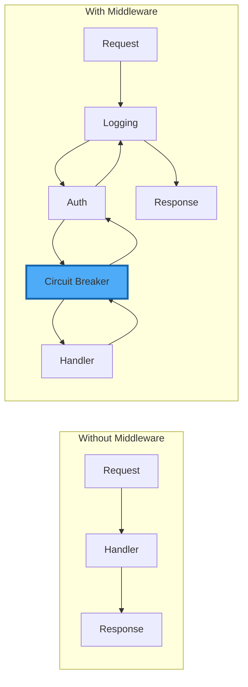

### 1.2 Go Interface Contracts

```go
// HTTP Server middleware: func(http.Handler) http.Handler
type Middleware func(http.Handler) http.Handler

// HTTP Client middleware: http.RoundTripper
type RoundTripper interface {
    RoundTrip(*http.Request) (*http.Response, error)
}

// gRPC Client: UnaryClientInterceptor
type UnaryClientInterceptor func(
    ctx context.Context,
    method string,
    req, reply interface{},
    cc *ClientConn,
    invoker UnaryInvoker,
    opts ...CallOption,
) error
```

### 1.3 Request Interception Points

```mermaid
flowchart TB
    subgraph "HTTP Server"
        HS1["Incoming Request"]
        HS2["Middleware: Before"]
        HS3["Handler"]
        HS4["Middleware: After"]
        HS5["Response"]
        
        HS1 --> HS2 --> HS3 --> HS4 --> HS5
    end
    
    subgraph "HTTP Client"
        HC1["Outgoing Request"]
        HC2["RoundTripper: Before"]
        HC3["Actual HTTP Call"]
        HC4["RoundTripper: After"]
        HC5["Response to Caller"]
        
        HC1 --> HC2 --> HC3 --> HC4 --> HC5
    end
    
    subgraph "gRPC"
        G1["Client Call"]
        G2["Interceptor: Before"]
        G3["Server Handler"]
        G4["Interceptor: After"]
        G5["Response"]
        
        G1 --> G2 --> G3 --> G4 --> G5
    end
    
    style HS2 fill:#69db7c,stroke:#2f9e44
    style HS4 fill:#69db7c,stroke:#2f9e44
    style HC2 fill:#4dabf7,stroke:#1864ab
    style HC4 fill:#4dabf7,stroke:#1864ab
    style G2 fill:#ffd43b,stroke:#e8590c
    style G4 fill:#ffd43b,stroke:#e8590c
```

---

## 2. HTTP Middleware Architecture

### 2.1 HTTPMiddleware Class Diagram

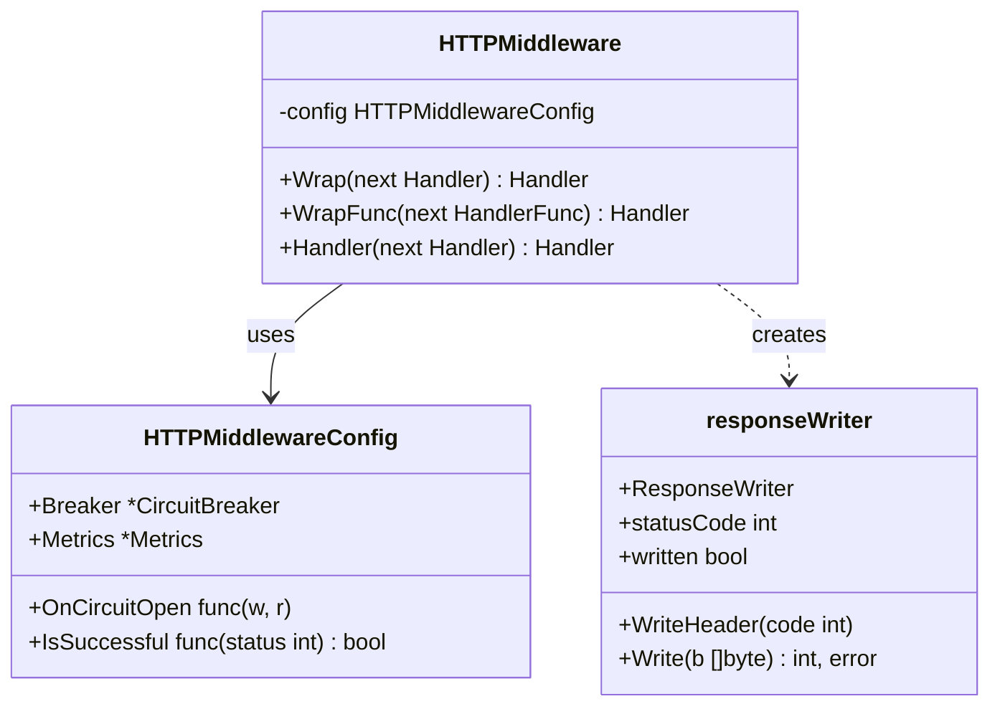

### 2.2 Request Flow Through Middleware

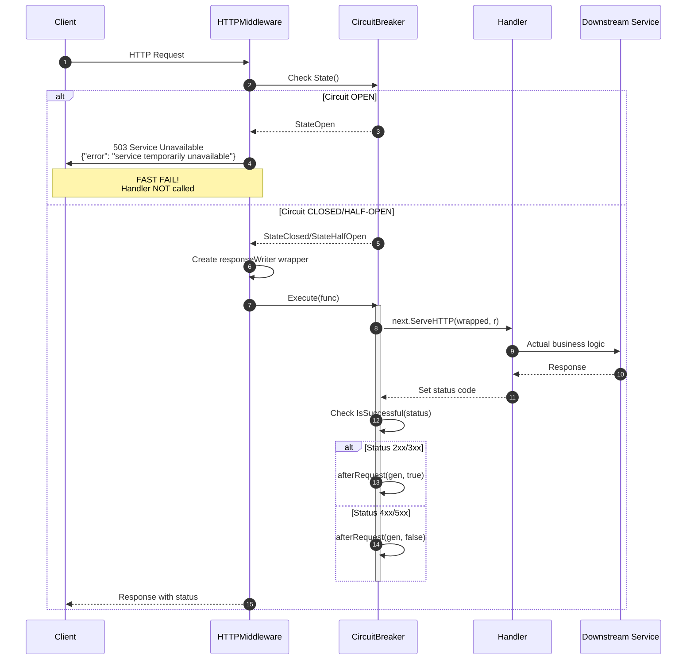

### 2.3 responseWriter Interception

**Problem**: Standard `http.ResponseWriter` doesn't expose the status code after `WriteHeader()`.

**Solution**: Wrap it to capture the status code.

```go
// internal/middleware/http_middleware.go:99-119
type responseWriter struct {
    http.ResponseWriter
    statusCode int
    written    bool
}

func (rw *responseWriter) WriteHeader(code int) {
    if !rw.written {
        rw.statusCode = code
        rw.written = true
        rw.ResponseWriter.WriteHeader(code)
    }
}

func (rw *responseWriter) Write(b []byte) (int, error) {
    if !rw.written {
        rw.WriteHeader(http.StatusOK)  // Default if not explicitly set
    }
    return rw.ResponseWriter.Write(b)
}
```

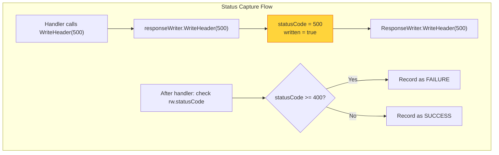

### 2.4 Default Circuit Open Handler

```go
// internal/middleware/http_middleware.go:131-136
func defaultCircuitOpenHandler(w http.ResponseWriter, r *http.Request) {
    w.Header().Set("Content-Type", "application/json")
    w.Header().Set("Retry-After", "30")  // ← Hint for clients
    w.WriteHeader(http.StatusServiceUnavailable)  // 503
    w.Write([]byte(`{"error":"service temporarily unavailable","retry_after":30}`))
}
```

---

## 3. HTTP Client (RoundTripper)

### 3.1 RoundTripper Interface

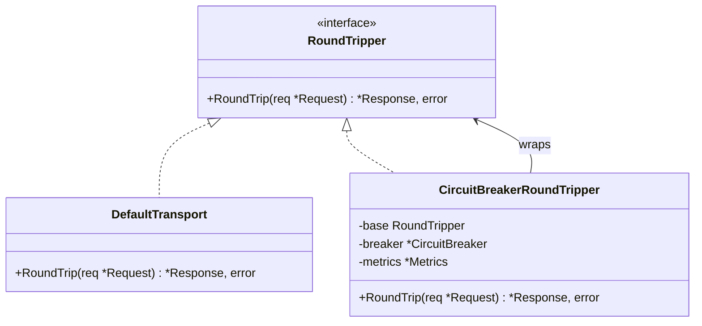

### 3.2 Client-Side Circuit Breaking Flow

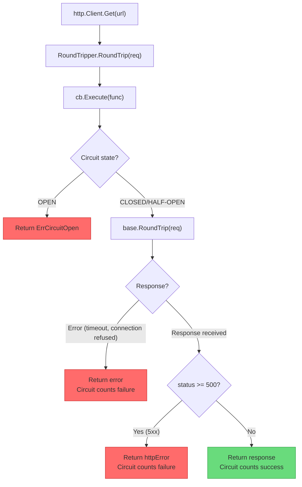

### 3.3 Code Walkthrough

```go
// internal/middleware/http_middleware.go:163-197
func (rt *RoundTripper) RoundTrip(req *http.Request) (*http.Response, error) {
    var resp *http.Response

    start := time.Now()
    err := rt.breaker.Execute(func() error {
        var err error
        resp, err = rt.base.RoundTrip(req)  // ← Actual HTTP call
        if err != nil {
            return err  // Connection error → FAILURE
        }

        // 5xx = Server error → FAILURE
        if resp.StatusCode >= 500 {
            return &httpError{statusCode: resp.StatusCode}
        }
        return nil  // 2xx, 3xx, 4xx → SUCCESS
    })

    duration := time.Since(start).Seconds()

    // Record metrics
    if rt.metrics != nil {
        if err == nil {
            rt.metrics.RecordSuccess(rt.breaker.Name())
            rt.metrics.RecordDuration(rt.breaker.Name(), "success", duration)
        } else if err == circuitbreaker.ErrCircuitOpen {
            rt.metrics.RecordRejection(rt.breaker.Name())
        } else {
            rt.metrics.RecordFailure(rt.breaker.Name())
            rt.metrics.RecordDuration(rt.breaker.Name(), "failure", duration)
        }
    }

    return resp, err
}
```

---

## 4. gRPC Interceptors

### 4.1 Interceptor Types

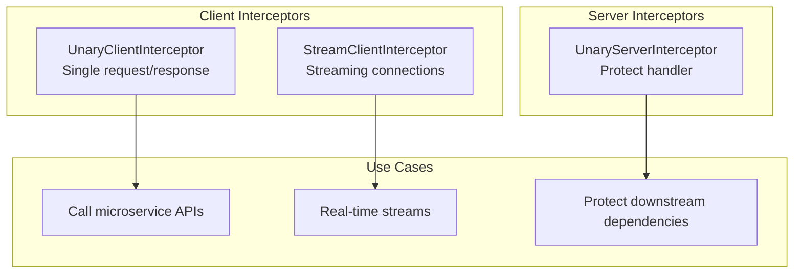

### 4.2 UnaryClientInterceptor Flow

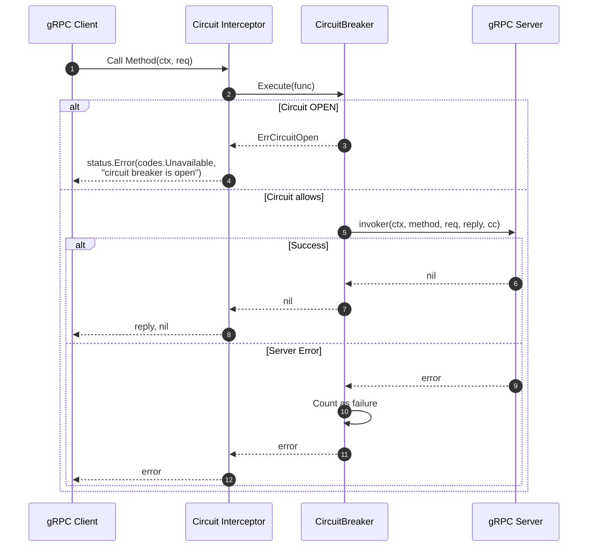

### 4.3 gRPC Error Code Mapping

```go
// internal/middleware/grpc_interceptor.go:49-61
if err == circuitbreaker.ErrCircuitOpen {
    if config.Metrics != nil {
        config.Metrics.RecordRejection(config.Breaker.Name())
    }
    return status.Error(codes.Unavailable, "circuit breaker is open")
}

if err == circuitbreaker.ErrTooManyRequests {
    if config.Metrics != nil {
        config.Metrics.RecordRejection(config.Breaker.Name())
    }
    return status.Error(codes.ResourceExhausted, "too many requests")
}
```

### 4.4 Stream Interceptor Specifics

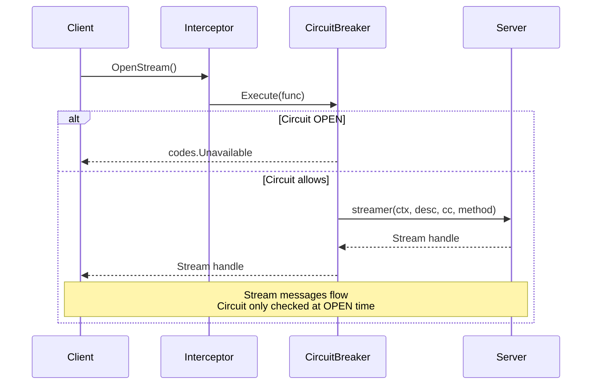

**Key Insight**: Stream interceptor chỉ check circuit khi **mở stream**, không check mỗi message trong stream.

---

## 5. Error Classification

### 5.1 HTTP Status Code Strategy

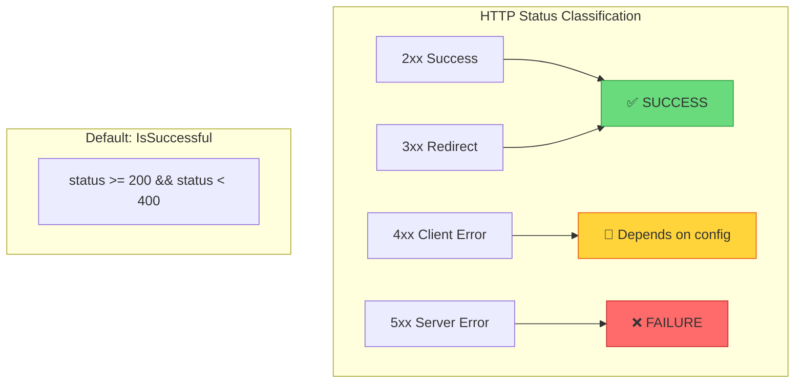

**Default Implementation**:

```go
// internal/middleware/http_middleware.go:139-141
func defaultIsSuccessful(status int) bool {
    return status >= 200 && status < 400
}
```

### 5.2 gRPC Error Code Strategy

```go
// internal/middleware/grpc_interceptor.go:167-196
func defaultGRPCIsSuccessful(err error) bool {
    if err == nil {
        return true
    }

    st, ok := status.FromError(err)
    if !ok {
        return false  // Unknown error → FAILURE
    }

    // These codes indicate CLIENT errors, not service failures
    switch st.Code() {
    case codes.OK:
        return true
    case codes.Canceled:       // Client cancelled
        return true
    case codes.InvalidArgument:// Bad request
        return true
    case codes.NotFound:       // Resource not found
        return true
    case codes.AlreadyExists:  // Duplicate
        return true
    case codes.PermissionDenied: // Auth error
        return true
    case codes.Unauthenticated:  // Auth error
        return true
    default:
        return false  // Server errors → FAILURE
    }
}
```

### 5.3 Error Classification Matrix

| Error Type | HTTP | gRPC | Trip Circuit? |
|------------|------|------|---------------|
| Success | 200-299 | OK | No ✅ |
| Bad Request | 400 | InvalidArgument | No (client fault) |
| Unauthorized | 401 | Unauthenticated | No (client fault) |
| Not Found | 404 | NotFound | No (expected) |
| Rate Limited | 429 | ResourceExhausted | Maybe 🤔 |
| Server Error | 500 | Internal | Yes ❌ |
| Service Unavailable | 503 | Unavailable | Yes ❌ |
| Timeout | - | DeadlineExceeded | Yes ❌ |
| Connection Refused | - | Unavailable | Yes ❌ |

---

## 6. Integration Patterns

### 6.1 Per-Service Circuit Breakers

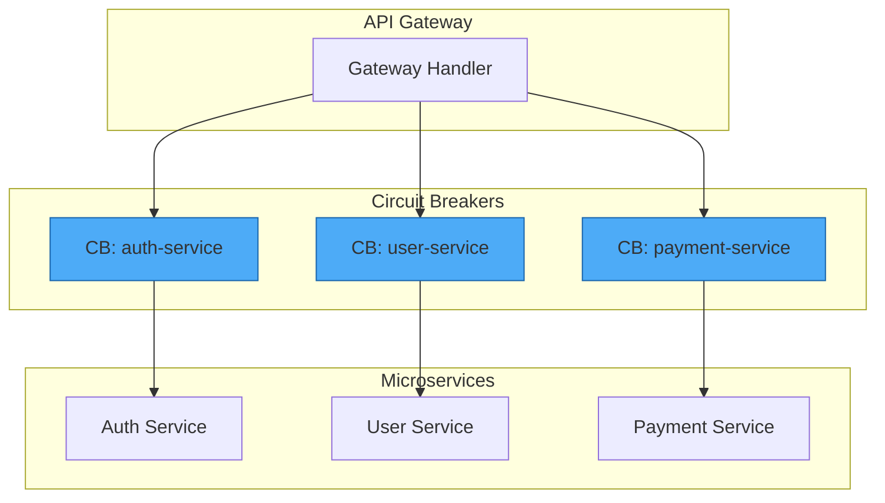

**Code Example**:

```go
// ✅ CORRECT: Separate circuit breaker per service
authClient := client.NewHTTPClient("auth-service", authConfig, metrics)
userClient := client.NewHTTPClient("user-service", userConfig, metrics)
paymentClient := client.NewHTTPClient("payment-service", paymentConfig, metrics)

// ❌ WRONG: Single shared circuit breaker
sharedCB := circuitbreaker.New("all-services", config)
// If auth-service fails, payment-service also blocked!
```

### 6.2 Anti-Pattern: Global Circuit Breaker

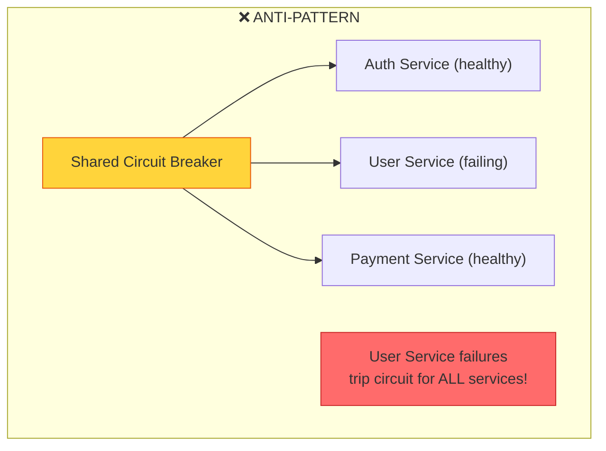

### 6.3 Middleware Chaining Order

```go
// Order matters! Circuit breaker should be OUTER layer
handler := loggingMiddleware(
    authMiddleware(
        circuitBreakerMiddleware(  // ← Check circuit FIRST
            rateLimitMiddleware(
                actualHandler,
            ),
        ),
    ),
)
```

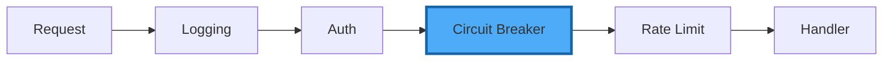

### 6.4 HTTPClient Wrapper Usage

```go
// pkg/client/http.go usage
func main() {
    metrics := circuitbreaker.NewMetrics("demo")
    
    config := circuitbreaker.Config{
        MaxRequests: 3,
        Timeout:     5 * time.Second,
        ReadyToTrip: func(counts circuitbreaker.Counts) bool {
            return counts.ConsecutiveFailures > 5
        },
    }
    
    // Create protected HTTP client
    httpClient := client.NewHTTPClient("payment-api", config, metrics)
    
    // Use like standard http.Client
    resp, err := httpClient.Get("https://api.payment.com/charge")
    if err == circuitbreaker.ErrCircuitOpen {
        // Fallback logic
        return useCachedPaymentStatus()
    }
}
```

---

## 🔗 Related Documents

- **Previous**: [03-CONCURRENCY-PATTERNS.md](./03-CONCURRENCY-PATTERNS.md) - Thread Safety
- **Next**: [05-OBSERVABILITY.md](./05-OBSERVABILITY.md) - Prometheus Metrics

---

## 🎯 Key Takeaways

> [!IMPORTANT]
> **Per-service circuit breakers** là bắt buộc. KHÔNG BAO GIỜ share một circuit breaker cho nhiều downstream services khác nhau.

> [!TIP]
> **HTTP 4xx vs 5xx**: 4xx là client errors (không nên trip circuit), 5xx là server errors (nên trip circuit). Customize `IsSuccessful` nếu cần behavior khác.

> [!NOTE]
> **gRPC Stream**: Circuit chỉ được check khi **mở stream**, không check mỗi message. Nếu cần protection per-message, implement riêng.

> [!WARNING]
> **Middleware order matters**: Circuit breaker nên là outer layer để có thể fast-fail trước khi các middleware khác xử lý.
