# 📊 OBSERVABILITY: Prometheus Metrics & Monitoring

> **Deep Dive**: Metrics design, alerting strategies, và Grafana dashboard patterns

---

## 📚 Mục Lục

1. [First Principles: Observability Pillars](#1-first-principles-observability-pillars)
2. [Prometheus Metrics Design](#2-prometheus-metrics-design)
3. [Each Metric Deep Dive](#3-each-metric-deep-dive)
4. [Alerting Strategies](#4-alerting-strategies)
5. [Grafana Dashboard Design](#5-grafana-dashboard-design)
6. [Distributed Tracing Integration](#6-distributed-tracing-integration)

---

## 1. First Principles: Observability Pillars

### 1.1 The Three Pillars

```mermaid
flowchart TB
    subgraph "Observability"
        METRICS["📈 METRICS<br/>What is happening?<br/>Aggregated numerical data"]
        LOGS["📝 LOGS<br/>Why did it happen?<br/>Detailed event records"]
        TRACES["🔗 TRACES<br/>Where did it happen?<br/>Request path through system"]
    end
    
    METRICS --> USE_M["Circuit state, failure rates,<br/>request counts, latency percentiles"]
    LOGS --> USE_L["State change events,<br/>specific error details"]
    TRACES --> USE_T["Request flow through<br/>circuit breaker + downstream"]
    
    style METRICS fill:#4dabf7,stroke:#1864ab,stroke-width:3px
```



### 1.2 Why Metrics for Circuit Breaker?

| Aspect | Why Metrics? |
|--------|-------------|
| **Real-time state** | Gauge shows current state instantly |
| **Aggregation** | Counters aggregate across replicas |
| **Alerting** | PromQL enables complex alert conditions |
| **Dashboards** | Visualize trends over time |
| **SLI/SLO** | Track availability targets |

### 1.3 Cardinality Considerations


---

## 2. Prometheus Metrics Design

### 2.1 Metrics Class Diagram


### 2.2 Metric Type Selection

| Use Case | Metric Type | Why? |
|----------|-------------|------|
| Total requests/failures | **Counter** | Monotonically increasing, calculate rates |
| Current circuit state | **Gauge** | Can go up or down |
| Request latency | **Histogram** | Distribution, percentiles |

### 2.3 Label Design

```go
// internal/circuitbreaker/metrics.go:20-79
func NewMetrics(namespace string) *Metrics {
    return &Metrics{
        requests: promauto.NewCounterVec(
            prometheus.CounterOpts{
                Namespace: namespace,                        // e.g., "myapp"
                Name:      "circuit_breaker_requests_total",
                Help:      "Total number of requests",
            },
            []string{"name"},  // ← Label: circuit breaker name
        ),
        
        stateChanges: promauto.NewCounterVec(
            prometheus.CounterOpts{
                Namespace: namespace,
                Name:      "circuit_breaker_state_changes_total",
                Help:      "Total number of state changes",
            },
            []string{"name", "from", "to"},  // ← Multiple labels
        ),
        
        requestLatency: promauto.NewHistogramVec(
            prometheus.HistogramOpts{
                Namespace: namespace,
                Name:      "circuit_breaker_request_duration_seconds",
                Help:      "Request duration in seconds",
                Buckets:   prometheus.DefBuckets,  // 5ms to 10s
            },
            []string{"name", "status"},  // ← status: success/failure
        ),
    }
}
```

---

## 3. Each Metric Deep Dive

### 3.1 circuit_breaker_requests_total

```
# TYPE circuit_breaker_requests_total counter
circuit_breaker_requests_total{name="auth-service"} 15234
circuit_breaker_requests_total{name="payment-api"} 8721
```

**Use Cases**:

- Calculate request rate: `rate(circuit_breaker_requests_total[5m])`
- Compare services: `topk(5, rate(circuit_breaker_requests_total[1h]))`

```go
// Recording
func (m *Metrics) RecordRequest(name string) {
    m.requests.WithLabelValues(name).Inc()
}
```

### 3.2 circuit_breaker_successes_total & circuit_breaker_failures_total

```
# TYPE circuit_breaker_successes_total counter
circuit_breaker_successes_total{name="auth-service"} 14892
circuit_breaker_failures_total{name="auth-service"} 342
```

**Use Cases**:

- Calculate failure rate:

  ```promql
  rate(circuit_breaker_failures_total[5m]) 
  / 
  rate(circuit_breaker_requests_total[5m])
  ```

### 3.3 circuit_breaker_rejections_total

```
# TYPE circuit_breaker_rejections_total counter
circuit_breaker_rejections_total{name="payment-api"} 523
```

**Meaning**: Requests rejected because circuit was OPEN (fast-fail).

**Use Cases**:

- Alert on sustained rejections
- Calculate protection effectiveness

```go
// Recording
func (m *Metrics) RecordRejection(name string) {
    m.rejections.WithLabelValues(name).Inc()
}
```

### 3.4 circuit_breaker_state

```
# TYPE circuit_breaker_state gauge
circuit_breaker_state{name="auth-service"} 0
circuit_breaker_state{name="payment-api"} 2
```

**Values**:

- `0` = CLOSED (normal)
- `1` = HALF_OPEN (testing recovery)
- `2` = OPEN (fast-fail mode)

```mermaid
flowchart LR
    S0["0 = CLOSED 🟢"]
    S1["1 = HALF_OPEN 🟡"]
    S2["2 = OPEN 🔴"]
    
    style S0 fill:#69db7c,stroke:#2f9e44
    style S1 fill:#ffd43b,stroke:#e8590c
    style S2 fill:#ff6b6b,stroke:#c92a2a
```



### 3.5 circuit_breaker_state_changes_total

```
# TYPE circuit_breaker_state_changes_total counter
circuit_breaker_state_changes_total{name="payment-api",from="closed",to="open"} 5
circuit_breaker_state_changes_total{name="payment-api",from="open",to="half-open"} 5
circuit_breaker_state_changes_total{name="payment-api",from="half-open",to="closed"} 3
circuit_breaker_state_changes_total{name="payment-api",from="half-open",to="open"} 2
```

**Use Cases**:

- Detect flapping: nhiều state changes trong thời gian ngắn
- Recovery analysis: how often does half-open → closed succeed?

### 3.6 circuit_breaker_request_duration_seconds

```
# TYPE circuit_breaker_request_duration_seconds histogram
circuit_breaker_request_duration_seconds_bucket{name="auth-service",status="success",le="0.005"} 234
circuit_breaker_request_duration_seconds_bucket{name="auth-service",status="success",le="0.01"} 512
circuit_breaker_request_duration_seconds_bucket{name="auth-service",status="success",le="0.025"} 893
circuit_breaker_request_duration_seconds_bucket{name="auth-service",status="success",le="+Inf"} 1000
circuit_breaker_request_duration_seconds_sum{name="auth-service",status="success"} 15.234
circuit_breaker_request_duration_seconds_count{name="auth-service",status="success"} 1000
```

**Use Cases**:

- P99 latency: `histogram_quantile(0.99, rate(circuit_breaker_request_duration_seconds_bucket[5m]))`
- Latency by status: compare success vs failure latency

---

## 4. Alerting Strategies

### 4.1 Circuit Open Alert

```yaml
# prometheus-rules.yaml
groups:
  - name: circuit_breaker
    rules:
      - alert: CircuitBreakerOpen
        expr: circuit_breaker_state == 2
        for: 1m
        labels:
          severity: warning
        annotations:
          summary: "Circuit breaker {{ $labels.name }} is OPEN"
          description: "Circuit breaker has been open for more than 1 minute"
```


### 4.2 Flapping Detection

**Flapping** = Circuit liên tục chuyển giữa OPEN ↔ CLOSED

```yaml
- alert: CircuitBreakerFlapping
  expr: |
    increase(circuit_breaker_state_changes_total[5m]) > 10
  for: 5m
  labels:
    severity: critical
  annotations:
    summary: "Circuit breaker {{ $labels.name }} is flapping"
    description: "More than 10 state changes in 5 minutes indicates unstable dependency"
```

### 4.3 High Failure Rate

```yaml
- alert: HighFailureRate
  expr: |
    (
      rate(circuit_breaker_failures_total[5m])
      /
      rate(circuit_breaker_requests_total[5m])
    ) > 0.5
  for: 2m
  labels:
    severity: warning
  annotations:
    summary: "High failure rate on {{ $labels.name }}"
    description: "More than 50% of requests failing"
```

### 4.4 Sustained Rejections

```yaml
- alert: SustainedRejections
  expr: |
    rate(circuit_breaker_rejections_total[5m]) > 100
  for: 5m
  labels:
    severity: critical
  annotations:
    summary: "High rejection rate on {{ $labels.name }}"
    description: "Circuit rejecting {{ $value }}/s requests"
```

---

## 5. Grafana Dashboard Design

### 5.1 Panel Layout

```mermaid
flowchart TB
    subgraph "Row 1: Overview"
        P1["🔢 Current State<br/>Stat Panel"]
        P2["📈 Request Rate<br/>Graph Panel"]
        P3["❌ Failure Rate<br/>Gauge Panel"]
    end
    
    subgraph "Row 2: State Changes"
        P4["📊 State Timeline<br/>State Timeline Panel"]
        P5["🔄 State Changes<br/>Bar Chart"]
    end
    
    subgraph "Row 3: Latency"
        P6["⏱️ P50/P95/P99 Latency<br/>Graph Panel"]
        P7["📉 Latency Heatmap<br/>Heatmap Panel"]
    end
```



### 5.2 Key PromQL Queries

**Request Rate**:

```promql
sum(rate(circuit_breaker_requests_total{name="$service"}[5m]))
```

**Failure Rate Percentage**:

```promql
100 * (
  rate(circuit_breaker_failures_total{name="$service"}[5m])
  /
  rate(circuit_breaker_requests_total{name="$service"}[5m])
)
```

**P99 Latency**:

```promql
histogram_quantile(0.99, 
  sum(rate(circuit_breaker_request_duration_seconds_bucket{name="$service"}[5m])) by (le)
)
```

**State Changes per Hour**:

```promql
increase(circuit_breaker_state_changes_total{name="$service"}[1h])
```

### 5.3 State Timeline Visualization

```
Time:     00:00    00:05    00:10    00:15    00:20
          │        │        │        │        │
State:    ████████│████████│▓▓▓▓▓▓▓▓│████████│████████
          CLOSED   OPEN     HALF-OPEN CLOSED   CLOSED
          🟢       🔴       🟡        🟢       🟢
```

**Grafana State Timeline** panel với mapping:

- `0` → Green (Closed)
- `1` → Yellow (Half-Open)
- `2` → Red (Open)

### 5.4 Dashboard JSON Snippet

```json
{
  "title": "Circuit Breaker Overview",
  "panels": [
    {
      "title": "Current State",
      "type": "stat",
      "targets": [
        {
          "expr": "circuit_breaker_state{name=\"$service\"}"
        }
      ],
      "mappings": [
        {"type": "value", "options": {"0": {"text": "CLOSED", "color": "green"}}},
        {"type": "value", "options": {"1": {"text": "HALF-OPEN", "color": "yellow"}}},
        {"type": "value", "options": {"2": {"text": "OPEN", "color": "red"}}}
      ]
    }
  ]
}
```

---

## 6. Distributed Tracing Integration

### 6.1 Context Propagation


### 6.2 Span Attributes

| Attribute | Type | Description |
|-----------|------|-------------|
| `cb.name` | string | Circuit breaker instance name |
| `cb.state` | string | State at request time: closed/open/half-open |
| `cb.success` | boolean | Whether request succeeded |
| `cb.rejected` | boolean | Whether request was rejected (circuit open) |
| `cb.duration_ms` | float | Request duration in milliseconds |

### 6.3 OpenTelemetry Example

```go
import (
    "go.opentelemetry.io/otel"
    "go.opentelemetry.io/otel/attribute"
)

func (cb *CircuitBreaker) ExecuteWithTracing(ctx context.Context, fn func() error) error {
    ctx, span := otel.Tracer("circuit-breaker").Start(ctx, "circuit_breaker.execute")
    defer span.End()
    
    // Record circuit breaker attributes
    span.SetAttributes(
        attribute.String("cb.name", cb.name),
        attribute.String("cb.state", cb.State().String()),
    )
    
    err := cb.Execute(fn)
    
    if err == ErrCircuitOpen {
        span.SetAttributes(attribute.Bool("cb.rejected", true))
    } else {
        span.SetAttributes(
            attribute.Bool("cb.success", err == nil),
            attribute.Bool("cb.rejected", false),
        )
    }
    
    return err
}
```

---

## 🔗 Related Documents

- **Previous**: [04-MIDDLEWARE-INTEGRATION.md](./04-MIDDLEWARE-INTEGRATION.md) - HTTP/gRPC Patterns
- **Back to**: [00-GRAND-MAP.md](./00-GRAND-MAP.md) - Architecture Overview

---

## 🎯 Key Takeaways

> [!IMPORTANT]
> **Metrics cardinality** quan trọng! Chỉ sử dụng low-cardinality labels như `name`, `state`, `status`. KHÔNG dùng `user_id` hoặc `request_id`.

> [!TIP]
> **Flapping detection** là critical alert. Circuit liên tục OPEN ↔ CLOSED cho thấy dependency không ổn định - cần investigate root cause.

> [!NOTE]
> **Histogram buckets** mặc định (5ms → 10s) phù hợp cho hầu hết use cases. Customize nếu services của bạn có latency profile đặc biệt.

> [!WARNING]
> **State gauge = 2 (OPEN)** kéo dài hơn expected timeout có nghĩa là circuit không thể recover. Đây là dấu hiệu của dependency completely down.

---

## 📋 Appendix: Complete Metrics Output

```
# HELP demo_circuit_breaker_requests_total Total number of requests
# TYPE demo_circuit_breaker_requests_total counter
demo_circuit_breaker_requests_total{name="auth-service"} 15234
demo_circuit_breaker_requests_total{name="payment-api"} 8721

# HELP demo_circuit_breaker_successes_total Total number of successful requests
# TYPE demo_circuit_breaker_successes_total counter
demo_circuit_breaker_successes_total{name="auth-service"} 14892
demo_circuit_breaker_successes_total{name="payment-api"} 8500

# HELP demo_circuit_breaker_failures_total Total number of failed requests
# TYPE demo_circuit_breaker_failures_total counter
demo_circuit_breaker_failures_total{name="auth-service"} 342
demo_circuit_breaker_failures_total{name="payment-api"} 221

# HELP demo_circuit_breaker_rejections_total Total number of rejected requests
# TYPE demo_circuit_breaker_rejections_total counter
demo_circuit_breaker_rejections_total{name="auth-service"} 0
demo_circuit_breaker_rejections_total{name="payment-api"} 523

# HELP demo_circuit_breaker_state Current state (0=closed, 1=half-open, 2=open)
# TYPE demo_circuit_breaker_state gauge
demo_circuit_breaker_state{name="auth-service"} 0
demo_circuit_breaker_state{name="payment-api"} 2

# HELP demo_circuit_breaker_state_changes_total Total number of state changes
# TYPE demo_circuit_breaker_state_changes_total counter
demo_circuit_breaker_state_changes_total{name="payment-api",from="closed",to="open"} 5
demo_circuit_breaker_state_changes_total{name="payment-api",from="open",to="half-open"} 5
demo_circuit_breaker_state_changes_total{name="payment-api",from="half-open",to="closed"} 3
demo_circuit_breaker_state_changes_total{name="payment-api",from="half-open",to="open"} 2

# HELP demo_circuit_breaker_request_duration_seconds Request duration in seconds
# TYPE demo_circuit_breaker_request_duration_seconds histogram
demo_circuit_breaker_request_duration_seconds_bucket{name="auth-service",status="success",le="0.005"} 5234
demo_circuit_breaker_request_duration_seconds_bucket{name="auth-service",status="success",le="0.01"} 12892
demo_circuit_breaker_request_duration_seconds_bucket{name="auth-service",status="success",le="0.025"} 14500
demo_circuit_breaker_request_duration_seconds_bucket{name="auth-service",status="success",le="+Inf"} 14892
demo_circuit_breaker_request_duration_seconds_sum{name="auth-service",status="success"} 127.234
demo_circuit_breaker_request_duration_seconds_count{name="auth-service",status="success"} 14892
```
